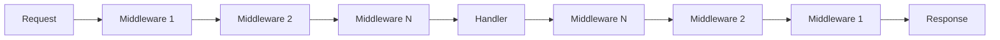

# Custom Middleware Development

Guide to creating custom middleware for specific use cases.

## Overview

Middleware functions process requests before they reach handlers or after handlers return responses. Use custom middleware for:
- Custom authentication logic
- Request validation
- Response transformation
- Logging and monitoring
- Rate limiting
- Custom authorization rules

## Middleware Architecture



## Basic Middleware Structure

### Simple Middleware

```go
// internal/api/middleware/custom.go
package middleware

import (
	"github.com/gin-gonic/gin"
)

func CustomMiddleware() gin.HandlerFunc {
	return func(c *gin.Context) {
		// Before handler
		// Do something before the handler executes
		
		c.Next() // Call next middleware/handler
		
		// After handler
		// Do something after the handler executes
	}
}
```

### Middleware with Configuration

```go
func CustomMiddleware(config Config) gin.HandlerFunc {
	// Setup/initialization
	validator := setupValidator(config)
	
	return func(c *gin.Context) {
		// Use config and initialized resources
		if !validator.IsValid(c.Request) {
			c.AbortWithStatusJSON(400, gin.H{"error": "Invalid request"})
			return
		}
		
		c.Next()
	}
}
```

## Example: Business Hours Middleware

Restrict API access to business hours only:

```go
// internal/api/middleware/business_hours.go
package middleware

import (
	"net/http"
	"time"
	
	"github.com/gin-gonic/gin"
)

type BusinessHoursConfig struct {
	StartHour int
	EndHour   int
	Timezone  *time.Location
	Exemptions []string // Exempt paths
}

func BusinessHours(config BusinessHoursConfig) gin.HandlerFunc {
	return func(c *gin.Context) {
		// Check if path is exempt
		for _, exempt := range config.Exemptions {
			if c.Request.URL.Path == exempt {
				c.Next()
				return
			}
		}
		
		// Get current hour in configured timezone
		now := time.Now().In(config.Timezone)
		hour := now.Hour()
		
		// Check if within business hours
		if hour < config.StartHour || hour >= config.EndHour {
			c.JSON(http.StatusForbidden, gin.H{
				"success": false,
				"error":   "API access is only available during business hours (9 AM - 5 PM)",
			})
			c.Abort()
			return
		}
		
		c.Next()
	}
}

// Usage in router
func SetupRouter() *gin.Engine {
	r := gin.Default()
	
	// Configure business hours
	timezone, _ := time.LoadLocation("America/New_York")
	businessHours := middleware.BusinessHours(middleware.BusinessHoursConfig{
		StartHour:  9,  // 9 AM
		EndHour:    17, // 5 PM
		Timezone:   timezone,
		Exemptions: []string{"/health", "/api/v1/auth/login"},
	})
	
	// Apply to protected routes
	api := r.Group("/api/v1")
	api.Use(businessHours)
	{
		api.POST("/tenants", handlers.CreateTenant)
		api.DELETE("/tenants/:id", handlers.DeleteTenant)
	}
	
	return r
}
```

## Example: Request ID Middleware

Add unique request ID for tracking:

```go
// internal/api/middleware/request_id.go
package middleware

import (
	"github.com/gin-gonic/gin"
	"github.com/google/uuid"
)

func RequestID() gin.HandlerFunc {
	return func(c *gin.Context) {
		// Check if request ID already exists in header
		requestID := c.GetHeader("X-Request-ID")
		
		if requestID == "" {
			// Generate new request ID
			requestID = uuid.New().String()
		}
		
		// Store in context for use by handlers
		c.Set("request_id", requestID)
		
		// Add to response header
		c.Header("X-Request-ID", requestID)
		
		c.Next()
	}
}

// Usage in handler
func (h *TenantHandler) CreateTenant(c *gin.Context) {
	requestID := c.GetString("request_id")
	
	h.logger.Info("Creating tenant",
		zap.String("request_id", requestID),
	)
	
	// ... handler logic
}
```

## Example: Rate Limiting Middleware

Implement rate limiting per user:

```go
// internal/api/middleware/rate_limit.go
package middleware

import (
	"net/http"
	"sync"
	"time"
	
	"github.com/gin-gonic/gin"
)

type RateLimiter struct {
	requests map[string][]time.Time
	mu       sync.RWMutex
	limit    int
	window   time.Duration
}

func NewRateLimiter(limit int, window time.Duration) *RateLimiter {
	rl := &RateLimiter{
		requests: make(map[string][]time.Time),
		limit:    limit,
		window:   window,
	}
	
	// Cleanup old entries periodically
	go rl.cleanup()
	
	return rl
}

func (rl *RateLimiter) cleanup() {
	ticker := time.NewTicker(1 * time.Minute)
	defer ticker.Stop()
	
	for range ticker.C {
		rl.mu.Lock()
		cutoff := time.Now().Add(-rl.window)
		for key, times := range rl.requests {
			// Remove old requests
			valid := []time.Time{}
			for _, t := range times {
				if t.After(cutoff) {
					valid = append(valid, t)
				}
			}
			
			if len(valid) == 0 {
				delete(rl.requests, key)
			} else {
				rl.requests[key] = valid
			}
		}
		rl.mu.Unlock()
	}
}

func (rl *RateLimiter) Middleware() gin.HandlerFunc {
	return func(c *gin.Context) {
		// Use user ID as key (or IP address if not authenticated)
		userID := c.GetString("user_id")
		if userID == "" {
			userID = c.ClientIP()
		}
		
		rl.mu.Lock()
		defer rl.mu.Unlock()
		
		now := time.Now()
		cutoff := now.Add(-rl.window)
		
		// Get user's requests
		requests := rl.requests[userID]
		
		// Filter to requests within window
		validRequests := []time.Time{}
		for _, t := range requests {
			if t.After(cutoff) {
				validRequests = append(validRequests, t)
			}
		}
		
		// Check if limit exceeded
		if len(validRequests) >= rl.limit {
			c.Header("X-RateLimit-Limit", fmt.Sprintf("%d", rl.limit))
			c.Header("X-RateLimit-Remaining", "0")
			c.Header("X-RateLimit-Reset", fmt.Sprintf("%d", validRequests[0].Add(rl.window).Unix()))
			
			c.JSON(http.StatusTooManyRequests, gin.H{
				"success": false,
				"error":   "Rate limit exceeded",
			})
			c.Abort()
			return
		}
		
		// Add current request
		validRequests = append(validRequests, now)
		rl.requests[userID] = validRequests
		
		// Add rate limit headers
		c.Header("X-RateLimit-Limit", fmt.Sprintf("%d", rl.limit))
		c.Header("X-RateLimit-Remaining", fmt.Sprintf("%d", rl.limit-len(validRequests)))
		
		c.Next()
	}
}

// Usage
rateLimiter := middleware.NewRateLimiter(100, 1*time.Minute) // 100 requests per minute

r.Use(rateLimiter.Middleware())
```

## Example: Response Caching Middleware

Cache GET responses:

```go
// internal/api/middleware/cache.go
package middleware

import (
	"bytes"
	"crypto/sha256"
	"encoding/hex"
	"io"
	"net/http"
	"sync"
	"time"
	
	"github.com/gin-gonic/gin"
)

type CacheEntry struct {
	Status  int
	Headers http.Header
	Body    []byte
	Expires time.Time
}

type Cache struct {
	entries map[string]*CacheEntry
	mu      sync.RWMutex
	ttl     time.Duration
}

func NewCache(ttl time.Duration) *Cache {
	return &Cache{
		entries: make(map[string]*CacheEntry),
		ttl:     ttl,
	}
}

func (cache *Cache) Middleware() gin.HandlerFunc {
	return func(c *gin.Context) {
		// Only cache GET requests
		if c.Request.Method != http.MethodGet {
			c.Next()
			return
		}
		
		// Generate cache key
		key := cache.generateKey(c.Request)
		
		// Check cache
		cache.mu.RLock()
		entry, found := cache.entries[key]
		cache.mu.RUnlock()
		
		if found && time.Now().Before(entry.Expires) {
			// Return cached response
			for k, v := range entry.Headers {
				c.Writer.Header()[k] = v
			}
			c.Writer.Header().Set("X-Cache", "HIT")
			c.Data(entry.Status, "application/json", entry.Body)
			c.Abort()
			return
		}
		
		// Capture response
		writer := &responseWriter{
			ResponseWriter: c.Writer,
			body:           &bytes.Buffer{},
		}
		c.Writer = writer
		
		c.Next()
		
		// Cache successful responses
		if writer.Status() == http.StatusOK {
			cache.mu.Lock()
			cache.entries[key] = &CacheEntry{
				Status:  writer.Status(),
				Headers: writer.Header().Clone(),
				Body:    writer.body.Bytes(),
				Expires: time.Now().Add(cache.ttl),
			}
			cache.mu.Unlock()
			
			c.Writer.Header().Set("X-Cache", "MISS")
		}
	}
}

func (cache *Cache) generateKey(req *http.Request) string {
	h := sha256.New()
	io.WriteString(h, req.URL.String())
	return hex.EncodeToString(h.Sum(nil))
}

type responseWriter struct {
	gin.ResponseWriter
	body *bytes.Buffer
}

func (w *responseWriter) Write(b []byte) (int, error) {
	w.body.Write(b)
	return w.ResponseWriter.Write(b)
}

// Usage
cache := middleware.NewCache(5 * time.Minute)

r.GET("/api/v1/public/data", cache.Middleware(), handlers.GetPublicData)
```

## Testing Custom Middleware

```go
// internal/api/middleware/business_hours_test.go
package middleware

import (
	"net/http"
	"net/http/httptest"
	"testing"
	"time"
	
	"github.com/gin-gonic/gin"
	"github.com/stretchr/testify/assert"
)

func TestBusinessHours(t *testing.T) {
	gin.SetMode(gin.TestMode)
	
	timezone, _ := time.LoadLocation("UTC")
	middleware := BusinessHours(BusinessHoursConfig{
		StartHour: 9,
		EndHour:   17,
		Timezone:  timezone,
	})
	
	tests := []struct {
		name       string
		hour       int
		expectCode int
	}{
		{"Before hours", 8, http.StatusForbidden},
		{"Start of hours", 9, http.StatusOK},
		{"During hours", 12, http.StatusOK},
		{"End of hours", 16, http.StatusOK},
		{"After hours", 17, http.StatusForbidden},
	}
	
	for _, tt := range tests {
		t.Run(tt.name, func(t *testing.T) {
			r := gin.New()
			r.Use(middleware)
			r.GET("/test", func(c *gin.Context) {
				c.JSON(200, gin.H{"ok": true})
			})
			
			req := httptest.NewRequest("GET", "/test", nil)
			w := httptest.NewRecorder()
			
			r.ServeHTTP(w, req)
			
			assert.Equal(t, tt.expectCode, w.Code)
		})
	}
}
```

## Best Practices

1. **Keep middleware focused** - One responsibility per middleware
2. **Handle errors gracefully** - Don't crash on unexpected input
3. **Use c.Abort()** - Stop processing chain when needed
4. **Set context values** - Share data between middleware and handlers
5. **Log appropriately** - Help with debugging
6. **Test thoroughly** - Unit test each middleware
7. **Document behavior** - Explain what the middleware does
8. **Consider performance** - Middleware runs on every request

## Related Documentation

- [Go Middleware](/middleware/go) - Standard middleware
- [Backend Integration](/guides/backend-integration) - Adding features
- [Security](/guides/security) - Security best practices
- [GitHub Repository](https://github.com/ysaakpr/rex) - Complete examples
