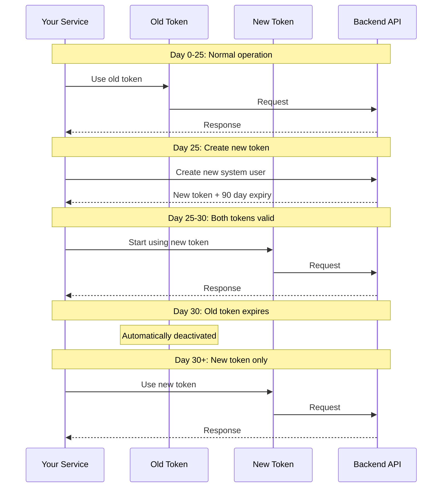

# Example: System User Credential Rotation

Complete example of rotating system user credentials with zero downtime.

## Scenario

Your production service uses a system user token that expires in 30 days. You need to rotate credentials before expiry without service interruption.

## Strategy: Overlapping Credentials



## Complete Example

### Step 1: Check Current Token Expiry

```bash
#!/bin/bash
# scripts/check-token-expiry.sh

TOKEN="your-current-token"
API_URL="http://localhost:8080"

# Get token info
response=$(curl -s -X GET "$API_URL/api/v1/system-users/token-info" \
  -H "Authorization: Bearer $TOKEN")

echo "$response" | jq '.'

# Extract expiry
expiry=$(echo "$response" | jq -r '.data.expires_at')
echo "Token expires: $expiry"

# Calculate days remaining
expires_epoch=$(date -j -f "%Y-%m-%dT%H:%M:%SZ" "$expiry" +%s)
now_epoch=$(date +%s)
days_remaining=$(( ($expires_epoch - $now_epoch) / 86400 ))

echo "Days remaining: $days_remaining"

if [ $days_remaining -lt 7 ]; then
  echo "⚠️  WARNING: Token expires soon! Rotate now."
  exit 1
fi
```

### Step 2: Create New Credential

```bash
#!/bin/bash
# scripts/rotate-credential.sh

PLATFORM_ADMIN_TOKEN="your-admin-token"
API_URL="http://localhost:8080"

echo "Creating new system user credential..."

# Create new system user
response=$(curl -s -X POST "$API_URL/api/v1/system-users" \
  -H "Authorization: Bearer $PLATFORM_ADMIN_TOKEN" \
  -H "Content-Type: application/json" \
  -d '{
    "name": "production-service-v2",
    "description": "Rotated credential for production service",
    "expires_in_days": 90
  }')

# Extract new token
NEW_TOKEN=$(echo "$response" | jq -r '.data.token')
NEW_ID=$(echo "$response" | jq -r '.data.id')

echo "New credential created:"
echo "ID: $NEW_ID"
echo "Token: $NEW_TOKEN"

# Save to secure storage
echo "$NEW_TOKEN" > /secure/new-token.txt
chmod 600 /secure/new-token.txt

echo "✓ New credential saved securely"
```

### Step 3: Deploy New Token (Zero Downtime)

#### Option A: Environment Variable Update

```bash
#!/bin/bash
# scripts/deploy-new-token.sh

NEW_TOKEN=$(cat /secure/new-token.txt)

# Update Kubernetes secret
kubectl create secret generic system-user-token \
  --from-literal=token="$NEW_TOKEN" \
  --dry-run=client -o yaml | kubectl apply -f -

# Rolling restart of pods
kubectl rollout restart deployment/your-service

# Wait for rollout
kubectl rollout status deployment/your-service

echo "✓ Service updated with new token"
```

#### Option B: Dynamic Configuration (Recommended)

```go
// config/credentials.go
package config

import (
    "context"
    "os"
    "sync"
    "time"
)

type CredentialManager struct {
    mu             sync.RWMutex
    currentToken   string
    tokenExpiresAt time.Time
    reloadInterval time.Duration
}

func NewCredentialManager() *CredentialManager {
    cm := &CredentialManager{
        reloadInterval: 5 * time.Minute,
    }
    
    // Load initial token
    cm.reload()
    
    // Start auto-reload
    go cm.autoReload()
    
    return cm
}

func (cm *CredentialManager) GetToken() string {
    cm.mu.RLock()
    defer cm.mu.RUnlock()
    return cm.currentToken
}

func (cm *CredentialManager) reload() {
    // Read from file or secret manager
    token, err := os.ReadFile("/run/secrets/system-user-token")
    if err != nil {
        log.Printf("Failed to reload token: %v", err)
        return
    }
    
    cm.mu.Lock()
    cm.currentToken = string(token)
    cm.mu.Unlock()
    
    log.Println("Token reloaded successfully")
}

func (cm *CredentialManager) autoReload() {
    ticker := time.NewTicker(cm.reloadInterval)
    defer ticker.Stop()
    
    for range ticker.C {
        cm.reload()
    }
}

// Usage in your service
var credMgr = NewCredentialManager()

func makeAPICall() {
    token := credMgr.GetToken()
    
    req, _ := http.NewRequest("GET", apiURL, nil)
    req.Header.Set("Authorization", "Bearer "+token)
    
    resp, _ := client.Do(req)
    // ...
}
```

### Step 4: Verify New Token Works

```bash
#!/bin/bash
# scripts/verify-new-token.sh

NEW_TOKEN=$(cat /secure/new-token.txt)
API_URL="http://localhost:8080"

echo "Testing new token..."

# Test API call
response=$(curl -s -w "\nHTTP_CODE:%{http_code}" \
  -H "Authorization: Bearer $NEW_TOKEN" \
  "$API_URL/api/v1/tenants")

http_code=$(echo "$response" | grep "HTTP_CODE" | cut -d: -f2)

if [ "$http_code" == "200" ]; then
  echo "✓ New token works!"
else
  echo "✗ New token failed with code: $http_code"
  echo "$response"
  exit 1
fi
```

### Step 5: Deactivate Old Token

```bash
#!/bin/bash
# scripts/deactivate-old-token.sh

PLATFORM_ADMIN_TOKEN="your-admin-token"
OLD_TOKEN_ID="old-system-user-id"
API_URL="http://localhost:8080"

echo "Deactivating old credential..."

# Deactivate
curl -X POST "$API_URL/api/v1/system-users/$OLD_TOKEN_ID/deactivate" \
  -H "Authorization: Bearer $PLATFORM_ADMIN_TOKEN"

echo "✓ Old credential deactivated"
```

## Automated Rotation Script

### Complete Automation

```bash
#!/bin/bash
# scripts/auto-rotate.sh

set -e

API_URL="${API_URL:-http://localhost:8080}"
PLATFORM_ADMIN_TOKEN="${PLATFORM_ADMIN_TOKEN}"
OLD_TOKEN_ID="${OLD_TOKEN_ID}"
ROTATION_THRESHOLD_DAYS=7

echo "=== System User Credential Rotation ==="
echo ""

# 1. Check current token expiry
echo "1. Checking current token..."
response=$(curl -s -X GET "$API_URL/api/v1/system-users/$OLD_TOKEN_ID" \
  -H "Authorization: Bearer $PLATFORM_ADMIN_TOKEN")

expires_at=$(echo "$response" | jq -r '.data.expires_at')
echo "Current token expires: $expires_at"

# Calculate days remaining
expires_epoch=$(date -j -f "%Y-%m-%dT%H:%M:%SZ" "$expires_at" +%s 2>/dev/null || date -d "$expires_at" +%s)
now_epoch=$(date +%s)
days_remaining=$(( ($expires_epoch - $now_epoch) / 86400 ))

echo "Days remaining: $days_remaining"

if [ $days_remaining -gt $ROTATION_THRESHOLD_DAYS ]; then
  echo "✓ Token still has $days_remaining days. No rotation needed."
  exit 0
fi

echo "⚠️  Token expires soon. Starting rotation..."
echo ""

# 2. Create new credential
echo "2. Creating new credential..."
new_response=$(curl -s -X POST "$API_URL/api/v1/system-users" \
  -H "Authorization: Bearer $PLATFORM_ADMIN_TOKEN" \
  -H "Content-Type: application/json" \
  -d "{
    \"name\": \"production-service-$(date +%Y%m%d)\",
    \"description\": \"Auto-rotated credential\",
    \"expires_in_days\": 90
  }")

NEW_TOKEN=$(echo "$new_response" | jq -r '.data.token')
NEW_ID=$(echo "$new_response" | jq -r '.data.id')

if [ "$NEW_TOKEN" == "null" ] || [ -z "$NEW_TOKEN" ]; then
  echo "✗ Failed to create new credential"
  echo "$new_response"
  exit 1
fi

echo "✓ New credential created: $NEW_ID"
echo ""

# 3. Update secret
echo "3. Updating Kubernetes secret..."
kubectl create secret generic system-user-token \
  --from-literal=token="$NEW_TOKEN" \
  --from-literal=id="$NEW_ID" \
  --dry-run=client -o yaml | kubectl apply -f -

echo "✓ Secret updated"
echo ""

# 4. Rolling restart
echo "4. Restarting service..."
kubectl rollout restart deployment/your-service
kubectl rollout status deployment/your-service --timeout=5m

echo "✓ Service restarted"
echo ""

# 5. Verify new token
echo "5. Verifying new token..."
verify_response=$(curl -s -w "\nHTTP_CODE:%{http_code}" \
  -H "Authorization: Bearer $NEW_TOKEN" \
  "$API_URL/api/v1/tenants")

http_code=$(echo "$verify_response" | grep "HTTP_CODE" | cut -d: -f2)

if [ "$http_code" != "200" ]; then
  echo "✗ New token verification failed!"
  echo "$verify_response"
  exit 1
fi

echo "✓ New token verified"
echo ""

# 6. Deactivate old token
echo "6. Deactivating old credential..."
curl -s -X POST "$API_URL/api/v1/system-users/$OLD_TOKEN_ID/deactivate" \
  -H "Authorization: Bearer $PLATFORM_ADMIN_TOKEN" > /dev/null

echo "✓ Old credential deactivated"
echo ""

echo "=== Rotation Complete! ==="
echo "New credential ID: $NEW_ID"
echo "Service is now using the new token"
```

### Cron Job for Automatic Rotation

```bash
# Add to crontab
# Run every day at 2 AM
0 2 * * * /path/to/auto-rotate.sh >> /var/log/credential-rotation.log 2>&1
```

## Best Practices

### 1. Grace Period

Always create new credentials before old ones expire:
- **Recommended**: 7 days before expiry
- **Minimum**: 3 days before expiry

### 2. Monitor Rotation

```bash
#!/bin/bash
# scripts/monitor-rotation.sh

# Send alerts if rotation fails
if ! /path/to/auto-rotate.sh; then
  # Send notification
  curl -X POST https://hooks.slack.com/... \
    -d '{"text": "⚠️ Credential rotation failed!"}'
fi
```

### 3. Test in Staging First

Always test rotation in staging environment before production.

### 4. Keep Audit Log

```bash
# Log all rotations
echo "$(date): Rotated from $OLD_ID to $NEW_ID" >> /var/log/credential-audit.log
```

### 5. Secure Token Storage

- Never commit tokens to git
- Use secret managers (AWS Secrets Manager, HashiCorp Vault)
- Encrypt tokens at rest
- Limit access permissions

## Related Documentation

- [System Users API](/x-api/system-users) - API reference
- [System Auth Usage](/system-auth/usage) - Using system auth
- [M2M Integration](/examples/m2m-integration) - Complete M2M example
