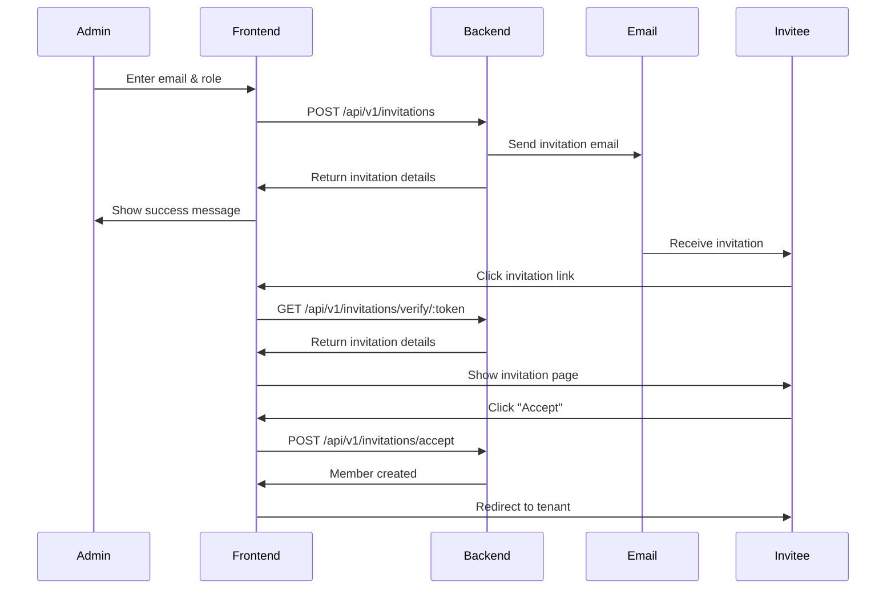

# Invitation Flow

Complete frontend implementation of the user invitation system.

## Overview

This guide covers the complete invitation flow from both perspectives:
- **Admin**: Sending invitations
- **Invitee**: Accepting invitations

## Invitation Flow Diagram



## Admin Side: Sending Invitations

### Step 1: Invitation Form Component

```jsx
// src/components/invitations/InvitationForm.jsx
import {useState, useEffect} from 'react';
import {useParams} from 'react-router-dom';
import {api} from '../../lib/api';
import {useSessionContext} from 'supertokens-auth-react/recipe/session';

export default function InvitationForm({onSuccess}) {
  const {tenant_id} = useParams();
  const session = useSessionContext();
  const [formData, setFormData] = useState({
    email: '',
    role_id: ''
  });
  const [roles, setRoles] = useState([]);
  const [loading, setLoading] = useState(false);
  const [error, setError] = useState(null);
  const [success, setSuccess] = useState(null);
  
  useEffect(() => {
    // Load available roles
    api.get('/api/v1/platform/roles')
      .then(response => setRoles(response.data.filter(r => r.type === 'tenant')))
      .catch(err => console.error('Failed to load roles:', err));
  }, []);
  
  const validateEmail = (email) => {
    return /^[^\s@]+@[^\s@]+\.[^\s@]+$/.test(email);
  };
  
  const handleSubmit = async (e) => {
    e.preventDefault();
    setLoading(true);
    setError(null);
    setSuccess(null);
    
    // Validate email
    if (!validateEmail(formData.email)) {
      setError('Please enter a valid email address');
      setLoading(false);
      return;
    }
    
    try {
      const response = await api.post('/api/v1/invitations', {
        tenant_id,
        email: formData.email,
        role_id: formData.role_id,
        invited_by: session.userId
      });
      
      setSuccess(`Invitation sent to ${formData.email}`);
      setFormData({email: '', role_id: ''});
      onSuccess?.(response.data);
    } catch (err) {
      setError(err.message || 'Failed to send invitation');
    } finally {
      setLoading(false);
    }
  };
  
  return (
    <div className="bg-white shadow rounded-lg p-6">
      <h2 className="text-xl font-semibold mb-4">Invite Team Member</h2>
      
      {error && (
        <div className="bg-red-50 border border-red-200 text-red-800 px-4 py-3 rounded mb-4">
          {error}
        </div>
      )}
      
      {success && (
        <div className="bg-green-50 border border-green-200 text-green-800 px-4 py-3 rounded mb-4">
          {success}
        </div>
      )}
      
      <form onSubmit={handleSubmit} className="space-y-4">
        <div>
          <label className="block text-sm font-medium text-gray-700 mb-2">
            Email Address *
          </label>
          <input
            type="email"
            value={formData.email}
            onChange={(e) => setFormData({...formData, email: e.target.value})}
            required
            className="w-full px-3 py-2 border border-gray-300 rounded focus:ring-blue-500 focus:border-blue-500"
            placeholder="colleague@example.com"
          />
        </div>
        
        <div>
          <label className="block text-sm font-medium text-gray-700 mb-2">
            Role *
          </label>
          <select
            value={formData.role_id}
            onChange={(e) => setFormData({...formData, role_id: e.target.value})}
            required
            className="w-full px-3 py-2 border border-gray-300 rounded focus:ring-blue-500 focus:border-blue-500"
          >
            <option value="">Select role...</option>
            {roles.map(role => (
              <option key={role.id} value={role.id}>
                {role.name} - {role.description}
              </option>
            ))}
          </select>
        </div>
        
        <button
          type="submit"
          disabled={loading || !formData.email || !formData.role_id}
          className="w-full px-4 py-2 bg-blue-600 text-white rounded hover:bg-blue-700 disabled:opacity-50 disabled:cursor-not-allowed"
        >
          {loading ? 'Sending...' : 'Send Invitation'}
        </button>
      </form>
    </div>
  );
}
```

### Step 2: Pending Invitations List

```jsx
// src/components/invitations/PendingInvitationsList.jsx
import {useState, useEffect} from 'react';
import {useParams} from 'react-router-dom';
import {api} from '../../lib/api';

export default function PendingInvitationsList() {
  const {tenant_id} = useParams();
  const [invitations, setInvitations] = useState([]);
  const [loading, setLoading] = useState(true);
  
  useEffect(() => {
    loadInvitations();
  }, [tenant_id]);
  
  const loadInvitations = async () => {
    try {
      const response = await api.get(
        `/api/v1/invitations?tenant_id=${tenant_id}&status=pending`
      );
      setInvitations(response.data.data || []);
      setLoading(false);
    } catch (err) {
      setLoading(false);
    }
  };
  
  const handleCancel = async (invitationId) => {
    if (!confirm('Cancel this invitation?')) return;
    
    try {
      await api.post(`/api/v1/invitations/${invitationId}/cancel`);
      setInvitations(invitations.filter(inv => inv.id !== invitationId));
    } catch (err) {
      alert('Failed to cancel invitation');
    }
  };
  
  const handleResend = async (invitation) => {
    try {
      await api.post('/api/v1/invitations', {
        tenant_id: invitation.tenant_id,
        email: invitation.email,
        role_id: invitation.role_id,
        invited_by: invitation.invited_by
      });
      alert('Invitation resent');
      loadInvitations();
    } catch (err) {
      alert('Failed to resend invitation');
    }
  };
  
  if (loading) return <div>Loading invitations...</div>;
  
  if (invitations.length === 0) {
    return (
      <div className="bg-white shadow rounded-lg p-6">
        <p className="text-gray-500 text-center">No pending invitations</p>
      </div>
    );
  }
  
  return (
    <div className="bg-white shadow rounded-lg overflow-hidden">
      <div className="px-6 py-4 border-b border-gray-200">
        <h3 className="text-lg font-semibold">Pending Invitations</h3>
      </div>
      
      <ul className="divide-y divide-gray-200">
        {invitations.map(invitation => (
          <li key={invitation.id} className="px-6 py-4">
            <div className="flex items-center justify-between">
              <div>
                <p className="font-medium">{invitation.email}</p>
                <p className="text-sm text-gray-500">
                  Role: {invitation.role_name} • 
                  Expires: {new Date(invitation.expires_at).toLocaleDateString()}
                </p>
              </div>
              <div className="flex gap-2">
                <button
                  onClick={() => handleResend(invitation)}
                  className="text-blue-600 hover:text-blue-800 text-sm"
                >
                  Resend
                </button>
                <button
                  onClick={() => handleCancel(invitation.id)}
                  className="text-red-600 hover:text-red-800 text-sm"
                >
                  Cancel
                </button>
              </div>
            </div>
          </li>
        ))}
      </ul>
    </div>
  );
}
```

## Invitee Side: Accepting Invitations

### Step 1: Accept Invitation Page

```jsx
// src/pages/AcceptInvitation.jsx
import {useEffect, useState} from 'react';
import {useParams, useNavigate} from 'react-router-dom';
import {useSessionContext} from 'supertokens-auth-react/recipe/session';
import {api} from '../lib/api';

export default function AcceptInvitation() {
  const {token} = useParams();
  const navigate = useNavigate();
  const session = useSessionContext();
  const [invitation, setInvitation] = useState(null);
  const [loading, setLoading] = useState(true);
  const [error, setError] = useState(null);
  const [accepting, setAccepting] = useState(false);
  
  useEffect(() => {
    verifyInvitation();
  }, [token]);
  
  const verifyInvitation = async () => {
    try {
      const response = await api.get(`/api/v1/invitations/verify/${token}`);
      const inv = response.data;
      
      // Check if invitation is valid
      if (inv.status !== 'pending') {
        setError('This invitation is no longer valid');
        setLoading(false);
        return;
      }
      
      // Check if expired
      if (new Date(inv.expires_at) < new Date()) {
        setError('This invitation has expired');
        setLoading(false);
        return;
      }
      
      setInvitation(inv);
      setLoading(false);
    } catch (err) {
      setError('Invalid invitation link');
      setLoading(false);
    }
  };
  
  const handleAccept = async () => {
    // Ensure user is logged in
    if (!session.doesSessionExist) {
      // Save token and redirect to login
      sessionStorage.setItem('invitation_token', token);
      navigate('/auth?redirect=/accept-invitation/' + token);
      return;
    }
    
    setAccepting(true);
    
    try {
      await api.post('/api/v1/invitations/accept', {token});
      
      // Success - redirect to tenant
      navigate(`/tenant/${invitation.tenant_slug}`);
    } catch (err) {
      setError(err.message || 'Failed to accept invitation');
      setAccepting(false);
    }
  };
  
  if (loading) {
    return (
      <div className="min-h-screen flex items-center justify-center bg-gray-50">
        <div className="text-center">
          <div className="animate-spin rounded-full h-12 w-12 border-b-2 border-blue-600 mx-auto mb-4"></div>
          <p className="text-gray-600">Verifying invitation...</p>
        </div>
      </div>
    );
  }
  
  if (error) {
    return (
      <div className="min-h-screen flex items-center justify-center bg-gray-50">
        <div className="max-w-md w-full bg-white shadow-lg rounded-lg p-8 text-center">
          <div className="text-6xl mb-4">❌</div>
          <h1 className="text-2xl font-bold text-gray-900 mb-4">
            Invalid Invitation
          </h1>
          <p className="text-gray-600 mb-6">{error}</p>
          <button
            onClick={() => navigate('/')}
            className="px-6 py-2 bg-blue-600 text-white rounded hover:bg-blue-700"
          >
            Go to Home
          </button>
        </div>
      </div>
    );
  }
  
  return (
    <div className="min-h-screen flex items-center justify-center bg-gray-50 px-4">
      <div className="max-w-md w-full bg-white shadow-lg rounded-lg p-8">
        <div className="text-center mb-6">
          <div className="text-6xl mb-4">📧</div>
          <h1 className="text-2xl font-bold text-gray-900 mb-2">
            You've Been Invited!
          </h1>
        </div>
        
        <div className="mb-6 space-y-3">
          <div className="bg-blue-50 p-4 rounded-lg">
            <p className="text-sm text-gray-600 mb-1">Organization</p>
            <p className="font-semibold text-lg">{invitation.tenant_name}</p>
          </div>
          
          <div className="flex gap-3">
            <div className="flex-1 bg-gray-50 p-4 rounded-lg">
              <p className="text-sm text-gray-600 mb-1">Role</p>
              <p className="font-semibold">{invitation.role_name}</p>
            </div>
            
            <div className="flex-1 bg-gray-50 p-4 rounded-lg">
              <p className="text-sm text-gray-600 mb-1">Invited By</p>
              <p className="font-semibold text-sm">{invitation.invited_by_email}</p>
            </div>
          </div>
          
          <div className="bg-gray-50 p-4 rounded-lg">
            <p className="text-sm text-gray-600 mb-1">Expires</p>
            <p className="font-semibold">
              {new Date(invitation.expires_at).toLocaleDateString('en-US', {
                year: 'numeric',
                month: 'long',
                day: 'numeric'
              })}
            </p>
          </div>
        </div>
        
        {!session.doesSessionExist && (
          <div className="mb-4 p-3 bg-yellow-50 border border-yellow-200 rounded">
            <p className="text-sm text-yellow-800">
              You need to sign in to accept this invitation
            </p>
          </div>
        )}
        
        <button
          onClick={handleAccept}
          disabled={accepting}
          className="w-full px-6 py-3 bg-blue-600 text-white font-semibold rounded-lg hover:bg-blue-700 disabled:opacity-50 disabled:cursor-not-allowed"
        >
          {accepting ? 'Accepting...' : session.doesSessionExist ? 'Accept Invitation' : 'Sign In & Accept'}
        </button>
        
        <p className="mt-4 text-center text-sm text-gray-500">
          By accepting, you'll become a member of {invitation.tenant_name}
        </p>
      </div>
    </div>
  );
}
```

### Step 2: Post-Login Redirect

Handle invitation acceptance after login:

```jsx
// src/App.jsx - Add route
<Route path="/accept-invitation/:token" element={<AcceptInvitation />} />

// After successful login, check for saved invitation
useEffect(() => {
  const savedToken = sessionStorage.getItem('invitation_token');
  if (savedToken && session.doesSessionExist) {
    sessionStorage.removeItem('invitation_token');
    navigate(`/accept-invitation/${savedToken}`);
  }
}, [session]);
```

## Complete Invitation Management Page

```jsx
// src/pages/ManageInvitations.jsx
import {useState} from 'react';
import InvitationForm from '../components/invitations/InvitationForm';
import PendingInvitationsList from '../components/invitations/PendingInvitationsList';

export default function ManageInvitations() {
  const [refreshKey, setRefreshKey] = useState(0);
  
  const handleInvitationSent = () => {
    // Refresh the pending invitations list
    setRefreshKey(prev => prev + 1);
  };
  
  return (
    <div className="max-w-4xl mx-auto space-y-6">
      <div>
        <h1 className="text-3xl font-bold text-gray-900 mb-2">
          Manage Invitations
        </h1>
        <p className="text-gray-600">
          Invite new members to join your team
        </p>
      </div>
      
      <div className="grid grid-cols-1 lg:grid-cols-2 gap-6">
        <InvitationForm onSuccess={handleInvitationSent} />
        <PendingInvitationsList key={refreshKey} />
      </div>
    </div>
  );
}
```

## Check for Pending Invitations on Login

Automatically show pending invitations after user logs in:

```jsx
// src/components/PendingInvitationsNotification.jsx
import {useEffect, useState} from 'react';
import {useNavigate} from 'react-router-dom';
import {useSessionContext} from 'supertokens-auth-react/recipe/session';
import {api} from '../lib/api';

export default function PendingInvitationsNotification() {
  const session = useSessionContext();
  const navigate = useNavigate();
  const [invitations, setInvitations] = useState([]);
  const [show, setShow] = useState(false);
  
  useEffect(() => {
    if (session.doesSessionExist) {
      checkPendingInvitations();
    }
  }, [session]);
  
  const checkPendingInvitations = async () => {
    try {
      const response = await api.get('/api/v1/invitations/pending');
      if (response.data.length > 0) {
        setInvitations(response.data);
        setShow(true);
      }
    } catch (err) {
      console.error('Failed to check invitations:', err);
    }
  };
  
  const handleViewInvitation = (token) => {
    navigate(`/accept-invitation/${token}`);
    setShow(false);
  };
  
  if (!show || invitations.length === 0) return null;
  
  return (
    <div className="fixed bottom-4 right-4 max-w-sm bg-white shadow-lg rounded-lg p-4 border border-gray-200">
      <div className="flex items-start justify-between mb-2">
        <h3 className="font-semibold text-gray-900">
          Pending Invitations ({invitations.length})
        </h3>
        <button
          onClick={() => setShow(false)}
          className="text-gray-400 hover:text-gray-600"
        >
          ×
        </button>
      </div>
      
      <p className="text-sm text-gray-600 mb-3">
        You have pending invitations to join teams
      </p>
      
      <div className="space-y-2">
        {invitations.map(inv => (
          <div
            key={inv.id}
            className="flex items-center justify-between p-2 bg-gray-50 rounded"
          >
            <div>
              <p className="font-medium text-sm">{inv.tenant_name}</p>
              <p className="text-xs text-gray-500">Role: {inv.role_name}</p>
            </div>
            <button
              onClick={() => handleViewInvitation(inv.token)}
              className="text-blue-600 hover:text-blue-800 text-sm font-medium"
            >
              View
            </button>
          </div>
        ))}
      </div>
    </div>
  );
}

// Add to main layout
<MainLayout>
  <PendingInvitationsNotification />
  <Outlet />
</MainLayout>
```

## Best Practices

1. **Validate Email Before Sending**: Check format and prevent duplicates
2. **Show Clear Expiration**: Display when invitation expires
3. **Allow Resend**: Let admins resend expired invitations
4. **Require Login**: Ensure user is authenticated before accepting
5. **Redirect After Accept**: Take user directly to tenant
6. **Show Status**: Display pending/accepted/expired invitations
7. **Auto-Check on Login**: Notify users of pending invitations

## Testing

### Test Invitation Flow

1. **As Admin**:
   - Send invitation to test email
   - Verify email received (check Mailhog in dev)
   - Check invitation appears in pending list

2. **As Invitee**:
   - Click invitation link
   - Verify invitation details displayed
   - Sign in (if needed)
   - Accept invitation
   - Verify redirected to tenant
   - Verify appears in member list

3. **Edge Cases**:
   - Expired invitation → Show error
   - Invalid token → Show error
   - Already accepted → Show error
   - Not logged in → Redirect to auth

## Next Steps

- [Managing Members](/guides/managing-members) - Member management
- [Component Examples](/frontend/component-examples) - UI components
- [API Calls](/frontend/api-calls) - API integration
- [Invitations Guide](/guides/invitations) - Backend details
