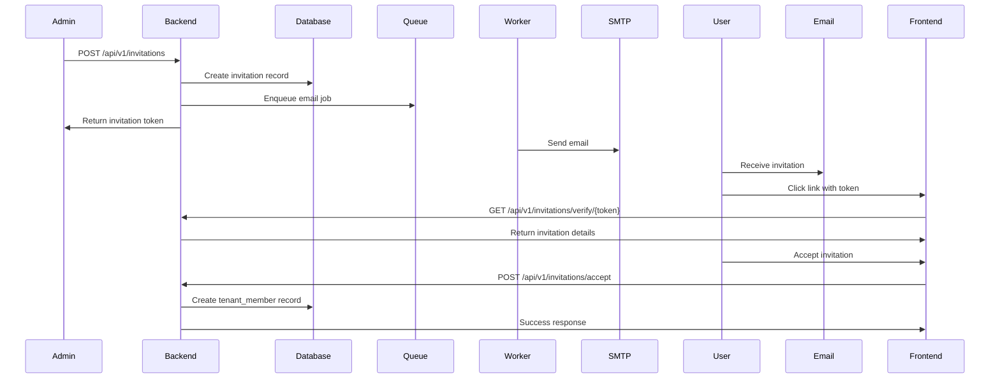

# Invitations

Complete guide to the user invitation system.

## Overview

The invitation system allows tenant admins to invite new users via email. Features:
- Email-based invitations with secure tokens
- 7-day expiration by default
- Role assignment on invitation
- Automatic member creation on acceptance
- Background email delivery

## Invitation Flow



## Creating Invitations

### API Request

```javascript
const response = await fetch('/api/v1/invitations', {
  method: 'POST',
  credentials: 'include',
  headers: {'Content-Type': 'application/json'},
  body: JSON.stringify({
    tenant_id: 'tenant-uuid',
    email: 'newuser@example.com',
    role_id: 'role-uuid',
    invited_by: 'current-user-id'
  })
});

const {data} = await response.json();
console.log('Invitation token:', data.token);
```

### Response

```json
{
  "success": true,
  "message": "Invitation created successfully",
  "data": {
    "id": "invitation-uuid",
    "tenant_id": "tenant-uuid",
    "email": "newuser@example.com",
    "token": "secure-random-token",
    "role_id": "role-uuid",
    "expires_at": "2024-12-01T10:00:00Z",
    "status": "pending",
    "created_at": "2024-11-24T10:00:00Z"
  }
}
```

## Listing Invitations

### Get All Tenant Invitations

```javascript
const response = await fetch(
  `/api/v1/invitations?tenant_id=${tenantId}&status=pending`,
  {credentials: 'include'}
);

const {data} = await response.json();
```

### Filter by Status

Available statuses:
- `pending` - Not yet accepted
- `accepted` - User accepted invitation
- `expired` - Past expiration date
- `cancelled` - Manually cancelled by admin

```javascript
// Get only pending invitations
const pending = await fetch(
  `/api/v1/invitations?tenant_id=${tenantId}&status=pending`,
  {credentials: 'include'}
).then(r => r.json());

// Get accepted invitations
const accepted = await fetch(
  `/api/v1/invitations?tenant_id=${tenantId}&status=accepted`,
  {credentials: 'include'}
).then(r => r.json());
```

## Accepting Invitations

### Step 1: Verify Token

```javascript
const response = await fetch(`/api/v1/invitations/verify/${token}`);
const {data} = await response.json();

// Check if valid
if (data.status !== 'pending') {
  alert('Invitation is no longer valid');
}

if (new Date(data.expires_at) < new Date()) {
  alert('Invitation has expired');
}
```

### Step 2: Accept Invitation

```javascript
const response = await fetch('/api/v1/invitations/accept', {
  method: 'POST',
  credentials: 'include',
  headers: {'Content-Type': 'application/json'},
  body: JSON.stringify({token})
});

if (response.ok) {
  // Redirect to tenant
  window.location.href = `/tenant/${tenantSlug}`;
}
```

## Frontend Implementation

### Invitation Form Component

```jsx
import {useState} from 'react';

export default function InviteMemberForm({tenantId, onSuccess}) {
  const [email, setEmail] = useState('');
  const [roleId, setRoleId] = useState('');
  const [loading, setLoading] = useState(false);
  const [roles, setRoles] = useState([]);
  
  useEffect(() => {
    // Load available roles
    fetch('/api/v1/platform/roles', {credentials: 'include'})
      .then(res => res.json())
      .then(data => setRoles(data.data));
  }, []);
  
  const handleSubmit = async (e) => {
    e.preventDefault();
    setLoading(true);
    
    try {
      const response = await fetch('/api/v1/invitations', {
        method: 'POST',
        credentials: 'include',
        headers: {'Content-Type': 'application/json'},
        body: JSON.stringify({
          tenant_id: tenantId,
          email,
          role_id: roleId,
          invited_by: currentUserId
        })
      });
      
      if (response.ok) {
        alert('Invitation sent!');
        setEmail('');
        onSuccess?.();
      }
    } catch (error) {
      alert('Failed to send invitation');
    } finally {
      setLoading(false);
    }
  };
  
  return (
    <form onSubmit={handleSubmit} className="space-y-4">
      <div>
        <label className="block text-sm font-medium mb-1">Email</label>
        <input
          type="email"
          value={email}
          onChange={(e) => setEmail(e.target.value)}
          required
          className="w-full px-3 py-2 border rounded"
        />
      </div>
      
      <div>
        <label className="block text-sm font-medium mb-1">Role</label>
        <select
          value={roleId}
          onChange={(e) => setRoleId(e.target.value)}
          required
          className="w-full px-3 py-2 border rounded"
        >
          <option value="">Select role...</option>
          {roles.map(role => (
            <option key={role.id} value={role.id}>{role.name}</option>
          ))}
        </select>
      </div>
      
      <button
        type="submit"
        disabled={loading}
        className="btn-primary"
      >
        {loading ? 'Sending...' : 'Send Invitation'}
      </button>
    </form>
  );
}
```

### Invitation Acceptance Page

```jsx
import {useEffect, useState} from 'react';
import {useParams, useNavigate} from 'react-router-dom';

export default function AcceptInvitation() {
  const {token} = useParams();
  const navigate = useNavigate();
  const [invitation, setInvitation] = useState(null);
  const [loading, setLoading] = useState(true);
  const [error, setError] = useState(null);
  
  useEffect(() => {
    // Verify invitation
    fetch(`/api/v1/invitations/verify/${token}`)
      .then(res => res.json())
      .then(data => {
        setInvitation(data.data);
        setLoading(false);
      })
      .catch(err => {
        setError('Invalid invitation');
        setLoading(false);
      });
  }, [token]);
  
  const acceptInvitation = async () => {
    try {
      const response = await fetch('/api/v1/invitations/accept', {
        method: 'POST',
        credentials: 'include',
        headers: {'Content-Type': 'application/json'},
        body: JSON.stringify({token})
      });
      
      if (response.ok) {
        navigate(`/tenant/${invitation.tenant_slug}`);
      }
    } catch (error) {
      alert('Failed to accept invitation');
    }
  };
  
  if (loading) return <div>Loading...</div>;
  if (error) return <div>Error: {error}</div>;
  
  return (
    <div className="max-w-md mx-auto mt-10 p-6 bg-white rounded-lg shadow">
      <h1 className="text-2xl font-bold mb-4">You've been invited!</h1>
      
      <div className="mb-6">
        <p className="text-gray-600 mb-2">
          You've been invited to join <strong>{invitation.tenant_name}</strong>
        </p>
        <p className="text-sm text-gray-500">
          Role: {invitation.role_name}
        </p>
        <p className="text-sm text-gray-500">
          Invited by: {invitation.invited_by_email}
        </p>
      </div>
      
      <button
        onClick={acceptInvitation}
        className="w-full btn-primary"
      >
        Accept Invitation
      </button>
    </div>
  );
}
```

## Canceling Invitations

### API Request

```javascript
await fetch(`/api/v1/invitations/${invitationId}/cancel`, {
  method: 'POST',
  credentials: 'include'
});
```

### Use Cases

- User already joined via different invitation
- Invitation sent to wrong email
- Role requirements changed
- Security concerns

## Email Customization

### Default Email Template

```html
<h2>You've been invited to join {{TenantName}}</h2>

<p>{{InviterName}} has invited you to join their team on Rex.</p>

<p><strong>Role:</strong> {{RoleName}}</p>

<p>
  <a href="{{AcceptLink}}">Accept Invitation</a>
</p>

<p>This invitation will expire on {{ExpiryDate}}.</p>
```

### Customize Email Template

```go
// internal/services/email_service.go
type InvitationEmailData struct {
    TenantName  string
    InviterName string
    RoleName    string
    AcceptLink  string
    ExpiryDate  string
}

func SendInvitationEmail(to string, data InvitationEmailData) error {
    // Load template
    tmpl := loadTemplate("invitation.html")
    
    // Render with data
    var body bytes.Buffer
    tmpl.Execute(&body, data)
    
    // Send email
    return sendEmail(to, "Invitation to join "+data.TenantName, body.String())
}
```

## Security Considerations

### Token Generation

```go
// Generate secure random token
func GenerateInvitationToken() string {
    b := make([]byte, 32)
    rand.Read(b)
    return base64.URLEncoding.EncodeToString(b)
}
```

### Expiration

- Default: 7 days
- Configurable per invitation
- Automatically cleanup expired invitations

```go
// Cleanup expired invitations (cron job)
func CleanupExpiredInvitations() {
    db.Where("expires_at < ? AND status = ?", time.Now(), "pending").
        Update("status", "expired")
}
```

### Rate Limiting

Prevent invitation spam:

```go
// Limit: 10 invitations per tenant per hour
func CheckInvitationRateLimit(tenantID uuid.UUID) error {
    var count int64
    db.Model(&models.Invitation{}).
        Where("tenant_id = ? AND created_at > ?", tenantID, time.Now().Add(-1*time.Hour)).
        Count(&count)
    
    if count >= 10 {
        return errors.New("rate limit exceeded")
    }
    
    return nil
}
```

## Best Practices

1. **Validate email addresses** before sending
2. **Check for existing members** before creating invitation
3. **Prevent duplicate invitations** to same email
4. **Log invitation events** for audit trail
5. **Send confirmation email** to inviter after acceptance
6. **Clean up expired invitations** regularly

## Troubleshooting

### Email Not Received

1. Check email logs in Mailhog (development)
2. Verify SMTP configuration (production)
3. Check spam folder
4. Verify email address is correct

### Invitation Expired

- Resend invitation with new token
- Update expiration settings if needed

### Cannot Accept Invitation

- User must be signed in
- Token must be valid and not expired
- Tenant must still exist
- Role must still exist

## Next Steps

- [Managing Members](/guides/managing-members) - Member management
- [Invitation Flow](/frontend/invitation-flow) - Frontend implementation
- [Member Management](/guides/member-management) - Complete member guide
