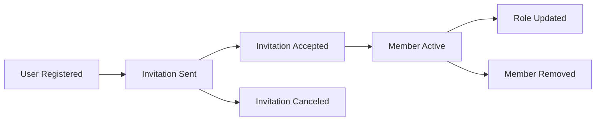

# Managing Members

Complete guide to managing tenant members, roles, and invitations.

## Overview

Tenant members are users who belong to a tenant with specific roles and permissions. This guide covers:
- Adding and removing members
- Managing member roles
- User invitations
- Member lifecycle
- Access control

## Member Lifecycle



## Adding Members

### Method 1: Direct Add (Existing Users)

Add an existing registered user directly to your tenant.

```javascript
const response = await fetch(`/api/v1/tenants/${tenantId}/members`, {
  method: 'POST',
  credentials: 'include',
  headers: {'Content-Type': 'application/json'},
  body: JSON.stringify({
    user_id: 'auth0|user123',
    role_id: 'writer-role-uuid'
  })
});

const {data} = await response.json();
console.log('Member added:', data);
```

**When to use**: User already has an account and you know their user ID.

### Method 2: Invitation (New or Existing Users)

Send an email invitation that new or existing users can accept.

```javascript
const response = await fetch('/api/v1/invitations', {
  method: 'POST',
  credentials: 'include',
  headers: {'Content-Type': 'application/json'},
  body: JSON.stringify({
    tenant_id: tenantId,
    email: 'newuser@example.com',
    role_id: 'viewer-role-uuid',
    invited_by: currentUserId
  })
});

const {data} = await response.json();
console.log('Invitation sent:', data.token);
```

**When to use**: Preferred method for onboarding new team members.

**Invitation Flow**:
1. Admin sends invitation
2. User receives email with invitation link
3. User clicks link → redirected to frontend
4. Frontend calls accept endpoint
5. User becomes active member

## Listing Members

### Get All Tenant Members

```javascript
const response = await fetch(
  `/api/v1/tenants/${tenantId}/members?page=1&page_size=20`,
  {credentials: 'include'}
);

const {data} = await response.json();

data.data.forEach(member => {
  console.log(`${member.user_id}: ${member.role_name}`);
});
```

### Filter by Role

```javascript
const response = await fetch(
  `/api/v1/tenants/${tenantId}/members?role_id=${roleId}`,
  {credentials: 'include'}
);
```

### Get Member Details

```javascript
const response = await fetch(
  `/api/v1/tenants/${tenantId}/members/${userId}`,
  {credentials: 'include'}
);

const {data} = await response.json();
console.log('Member:', {
  user_id: data.user_id,
  role: data.role_name,
  joined: data.created_at,
  active: data.is_active
});
```

## Updating Member Roles

### Change Member Role

```javascript
const response = await fetch(
  `/api/v1/tenants/${tenantId}/members/${userId}`,
  {
    method: 'PATCH',
    credentials: 'include',
    headers: {'Content-Type': 'application/json'},
    body: JSON.stringify({
      role_id: 'admin-role-uuid'
    })
  }
);
```

### Assign Multiple Roles (RBAC)

For advanced RBAC setups with multiple roles per user:

```javascript
// Assign additional role
await fetch(`/api/v1/tenants/${tenantId}/members/${userId}/roles`, {
  method: 'POST',
  credentials: 'include',
  headers: {'Content-Type': 'application/json'},
  body: JSON.stringify({
    role_ids: ['editor-role-uuid', 'publisher-role-uuid']
  })
});

// Remove role
await fetch(
  `/api/v1/tenants/${tenantId}/members/${userId}/roles/${roleId}`,
  {
    method: 'DELETE',
    credentials: 'include'
  }
);
```

## Removing Members

### Remove Member from Tenant

```javascript
const response = await fetch(
  `/api/v1/tenants/${tenantId}/members/${userId}`,
  {
    method: 'DELETE',
    credentials: 'include'
  }
);

if (response.ok) {
  console.log('Member removed successfully');
}
```

:::warning Effect
- Removes member from tenant
- Revokes all permissions in this tenant
- User account remains active (can join other tenants)
- Historical data (audit logs) preserved
:::

### Deactivate vs Remove

**Deactivate** (soft delete):
```javascript
await fetch(`/api/v1/tenants/${tenantId}/members/${userId}`, {
  method: 'PATCH',
  credentials: 'include',
  headers: {'Content-Type': 'application/json'},
  body: JSON.stringify({is_active: false})
});
```
- Member record preserved
- Access immediately revoked
- Can be reactivated later

**Remove** (hard delete):
```javascript
await fetch(`/api/v1/tenants/${tenantId}/members/${userId}`, {
  method: 'DELETE',
  credentials: 'include'
});
```
- Member record deleted
- Cannot be undone
- User must be re-added to regain access

## Invitation System

### Creating Invitations

```javascript
async function inviteMember(tenantId, email, roleId) {
  const response = await fetch('/api/v1/invitations', {
    method: 'POST',
    credentials: 'include',
    headers: {'Content-Type': 'application/json'},
    body: JSON.stringify({
      tenant_id: tenantId,
      email: email,
      role_id: roleId,
      invited_by: currentUserId
    })
  });
  
  const {data} = await response.json();
  
  // Email automatically sent by backend
  return data;
}
```

### Listing Invitations

```javascript
// Get all pending invitations for a tenant
const response = await fetch(
  `/api/v1/invitations?tenant_id=${tenantId}&status=pending`,
  {credentials: 'include'}
);

const {data} = await response.json();
data.data.forEach(inv => {
  console.log(`${inv.email} - expires: ${inv.expires_at}`);
});
```

### Accepting Invitations

**Frontend flow**:

```jsx
// InvitationAccept.jsx
import {useParams, useNavigate} from 'react-router-dom';
import {useEffect, useState} from 'react';

function AcceptInvitation() {
  const {token} = useParams();
  const navigate = useNavigate();
  const [invitation, setInvitation] = useState(null);
  
  useEffect(() => {
    // Fetch invitation details
    fetch(`/api/v1/invitations/verify/${token}`)
      .then(res => res.json())
      .then(data => setInvitation(data.data));
  }, [token]);
  
  const acceptInvitation = async () => {
    const response = await fetch('/api/v1/invitations/accept', {
      method: 'POST',
      credentials: 'include',
      headers: {'Content-Type': 'application/json'},
      body: JSON.stringify({token})
    });
    
    if (response.ok) {
      navigate(`/tenant/${invitation.tenant_slug}`);
    }
  };
  
  if (!invitation) return <div>Loading...</div>;
  
  return (
    <div>
      <h2>You've been invited to {invitation.tenant_name}</h2>
      <p>Role: {invitation.role_name}</p>
      <button onClick={acceptInvitation}>Accept Invitation</button>
    </div>
  );
}
```

### Canceling Invitations

```javascript
await fetch(`/api/v1/invitations/${invitationId}/cancel`, {
  method: 'POST',
  credentials: 'include'
});
```

### Invitation Expiry

- Default expiry: 7 days
- Expired invitations automatically rejected
- Re-send invitation to generate new token

## Complete Member Management Component

```jsx
import {useEffect, useState} from 'react';

function MemberManagement({tenantId}) {
  const [members, setMembers] = useState([]);
  const [invitations, setInvitations] = useState([]);
  const [roles, setRoles] = useState([]);
  
  useEffect(() => {
    loadMembers();
    loadInvitations();
    loadRoles();
  }, [tenantId]);
  
  const loadMembers = async () => {
    const response = await fetch(`/api/v1/tenants/${tenantId}/members`, {
      credentials: 'include'
    });
    const {data} = await response.json();
    setMembers(data.data);
  };
  
  const loadInvitations = async () => {
    const response = await fetch(
      `/api/v1/invitations?tenant_id=${tenantId}&status=pending`,
      {credentials: 'include'}
    );
    const {data} = await response.json();
    setInvitations(data.data || []);
  };
  
  const loadRoles = async () => {
    const response = await fetch('/api/v1/platform/roles', {
      credentials: 'include'
    });
    const {data} = await response.json();
    setRoles(data);
  };
  
  const inviteMember = async (email, roleId) => {
    await fetch('/api/v1/invitations', {
      method: 'POST',
      credentials: 'include',
      headers: {'Content-Type': 'application/json'},
      body: JSON.stringify({
        tenant_id: tenantId,
        email,
        role_id: roleId,
        invited_by: currentUserId
      })
    });
    loadInvitations();
  };
  
  const updateMemberRole = async (userId, roleId) => {
    await fetch(`/api/v1/tenants/${tenantId}/members/${userId}`, {
      method: 'PATCH',
      credentials: 'include',
      headers: {'Content-Type': 'application/json'},
      body: JSON.stringify({role_id: roleId})
    });
    loadMembers();
  };
  
  const removeMember = async (userId) => {
    if (!confirm('Remove this member?')) return;
    
    await fetch(`/api/v1/tenants/${tenantId}/members/${userId}`, {
      method: 'DELETE',
      credentials: 'include'
    });
    loadMembers();
  };
  
  const cancelInvitation = async (invitationId) => {
    await fetch(`/api/v1/invitations/${invitationId}/cancel`, {
      method: 'POST',
      credentials: 'include'
    });
    loadInvitations();
  };
  
  return (
    <div>
      <h2>Team Members</h2>
      
      {/* Invite Form */}
      <form onSubmit={(e) => {
        e.preventDefault();
        const email = e.target.email.value;
        const roleId = e.target.role.value;
        inviteMember(email, roleId);
        e.target.reset();
      }}>
        <input name="email" type="email" placeholder="Email" required />
        <select name="role" required>
          {roles.map(role => (
            <option key={role.id} value={role.id}>{role.name}</option>
          ))}
        </select>
        <button type="submit">Invite</button>
      </form>
      
      {/* Active Members */}
      <h3>Active Members ({members.length})</h3>
      <table>
        <thead>
          <tr>
            <th>Email</th>
            <th>Role</th>
            <th>Joined</th>
            <th>Actions</th>
          </tr>
        </thead>
        <tbody>
          {members.map(member => (
            <tr key={member.user_id}>
              <td>{member.email}</td>
              <td>
                <select 
                  value={member.role_id}
                  onChange={(e) => updateMemberRole(member.user_id, e.target.value)}
                >
                  {roles.map(role => (
                    <option key={role.id} value={role.id}>{role.name}</option>
                  ))}
                </select>
              </td>
              <td>{new Date(member.created_at).toLocaleDateString()}</td>
              <td>
                <button onClick={() => removeMember(member.user_id)}>
                  Remove
                </button>
              </td>
            </tr>
          ))}
        </tbody>
      </table>
      
      {/* Pending Invitations */}
      {invitations.length > 0 && (
        <>
          <h3>Pending Invitations ({invitations.length})</h3>
          <table>
            <thead>
              <tr>
                <th>Email</th>
                <th>Role</th>
                <th>Expires</th>
                <th>Actions</th>
              </tr>
            </thead>
            <tbody>
              {invitations.map(inv => (
                <tr key={inv.id}>
                  <td>{inv.email}</td>
                  <td>{inv.role_name}</td>
                  <td>{new Date(inv.expires_at).toLocaleDateString()}</td>
                  <td>
                    <button onClick={() => cancelInvitation(inv.id)}>
                      Cancel
                    </button>
                  </td>
                </tr>
              ))}
            </tbody>
          </table>
        </>
      )}
    </div>
  );
}
```

## Access Control

### Who Can Manage Members?

By default, these operations require specific permissions:

| Operation | Required Permission |
|-----------|---------------------|
| Invite members | `tenant-api:member:invite` |
| View members | `tenant-api:member:read` |
| Update member role | `tenant-api:member:update` |
| Remove members | `tenant-api:member:delete` |

**Typical role assignments**:
- **Admin**: All member management permissions
- **Writer**: Can view members
- **Viewer**: Can view members
- **Basic**: No member management access

### Check User Permissions

```javascript
async function canManageMembers(userId, tenantId) {
  const response = await fetch(
    `/api/v1/authorize?` +
    `tenant_id=${tenantId}&` +
    `user_id=${userId}&` +
    `service=tenant-api&` +
    `entity=member&` +
    `action=invite`,
    {credentials: 'include'}
  );
  
  const {data} = await response.json();
  return data.authorized;
}
```

## Best Practices

### Email Validation

```javascript
function isValidEmail(email) {
  return /^[^\s@]+@[^\s@]+\.[^\s@]+$/.test(email);
}

function inviteMember(email, roleId) {
  if (!isValidEmail(email)) {
    alert('Invalid email address');
    return;
  }
  // ... proceed with invitation
}
```

### Duplicate Prevention

```javascript
async function inviteMemberSafely(tenantId, email, roleId) {
  // Check if already a member
  const membersResp = await fetch(
    `/api/v1/tenants/${tenantId}/members`,
    {credentials: 'include'}
  );
  const {data} = await membersResp.json();
  
  const existingMember = data.data.find(m => m.email === email);
  if (existingMember) {
    alert('User is already a member');
    return;
  }
  
  // Check if already invited
  const invResp = await fetch(
    `/api/v1/invitations?tenant_id=${tenantId}&status=pending`,
    {credentials: 'include'}
  );
  const invData = await invResp.json();
  
  const existingInv = invData.data?.data?.find(i => i.email === email);
  if (existingInv) {
    alert('Invitation already pending');
    return;
  }
  
  // Send invitation
  return inviteMember(tenantId, email, roleId);
}
```

### Role Selection UI

```jsx
function RoleSelector({currentRole, onChange, disabled}) {
  const roles = [
    {id: 'admin', name: 'Admin', description: 'Full access'},
    {id: 'writer', name: 'Writer', description: 'Can create content'},
    {id: 'viewer', name: 'Viewer', description: 'Read-only access'}
  ];
  
  return (
    <select value={currentRole} onChange={onChange} disabled={disabled}>
      {roles.map(role => (
        <option key={role.id} value={role.id} title={role.description}>
          {role.name}
        </option>
      ))}
    </select>
  );
}
```

### Audit Logging

```javascript
function logMemberAction(action, userId, details) {
  // Send to analytics/logging service
  console.log('[Member Action]', {
    action,
    user_id: userId,
    tenant_id: currentTenantId,
    timestamp: new Date().toISOString(),
    ...details
  });
}

// Usage
logMemberAction('member_added', userId, {role: 'writer'});
logMemberAction('member_removed', userId, {reason: 'user_request'});
```

## Troubleshooting

### Invitation Email Not Received

1. Check email address is correct
2. Check spam/junk folder
3. Verify email service is configured (MailHog in dev, SMTP in prod)
4. Check invitation hasn't expired
5. Re-send invitation if needed

### Cannot Remove Last Admin

```javascript
// Prevent removing last admin
async function canRemoveMember(tenantId, userId, roleId) {
  if (roleId !== 'admin-role-uuid') return true;
  
  const response = await fetch(
    `/api/v1/tenants/${tenantId}/members?role_id=${roleId}`,
    {credentials: 'include'}
  );
  const {data} = await response.json();
  
  const adminCount = data.data.length;
  if (adminCount <= 1) {
    alert('Cannot remove last admin');
    return false;
  }
  
  return true;
}
```

### User Doesn't See Tenant After Accepting

1. Ensure invitation acceptance returned success
2. Check user is logged in with correct account
3. Verify member record created (check via API)
4. Frontend should call `/api/v1/users/me/tenants` to refresh tenant list

## Next Steps

- [Invitations API](/x-api/invitations) - API reference
- [Members API](/x-api/members) - API reference
- [RBAC Overview](/guides/rbac-overview) - Permission system
- [Roles & Policies](/guides/roles-policies) - Role management

