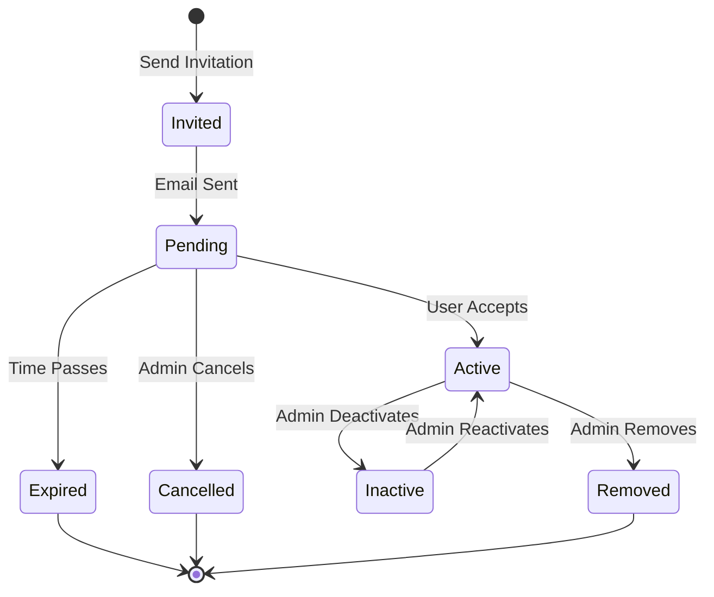

# Member Management Guide

Complete guide to managing tenant members, roles, and access.

## Overview

Members are users who belong to a tenant. Each member has:
- A unique user ID (from SuperTokens)
- A role (relation) within the tenant
- A membership status
- Metadata about invitation and joining

## Member Lifecycle



## Inviting Members

### Method 1: API Call

```javascript
// Invite a new member
const response = await fetch('/api/v1/invitations', {
  method: 'POST',
  credentials: 'include',
  headers: {'Content-Type': 'application/json'},
  body: JSON.stringify({
    tenant_id: 'tenant-uuid',
    email: 'newmember@example.com',
    role_id: 'role-uuid',  // Or use role_name
    expires_in_hours: 72   // Optional, default 72
  })
});

const invitation = await response.json();
console.log('Invitation created:', invitation.data);
// User will receive email with acceptance link
```

### Method 2: Frontend Component

```jsx
// InviteMemberForm.jsx
import { useState } from 'react';

export function InviteMemberForm({ tenantId, roles }) {
  const [email, setEmail] = useState('');
  const [roleId, setRoleId] = useState('');
  const [loading, setLoading] = useState(false);
  
  const handleSubmit = async (e) => {
    e.preventDefault();
    setLoading(true);
    
    try {
      const response = await fetch('/api/v1/invitations', {
        method: 'POST',
        credentials: 'include',
        headers: {'Content-Type': 'application/json'},
        body: JSON.stringify({
          tenant_id: tenantId,
          email,
          role_id: roleId
        })
      });
      
      if (response.ok) {
        alert('Invitation sent successfully!');
        setEmail('');
        setRoleId('');
      } else {
        const error = await response.json();
        alert('Error: ' + error.error);
      }
    } catch (err) {
      alert('Failed to send invitation');
    } finally {
      setLoading(false);
    }
  };
  
  return (
    <form onSubmit={handleSubmit}>
      <input
        type="email"
        value={email}
        onChange={(e) => setEmail(e.target.value)}
        placeholder="Email address"
        required
      />
      
      <select
        value={roleId}
        onChange={(e) => setRoleId(e.target.value)}
        required
      >
        <option value="">Select Role</option>
        {roles.map(role => (
          <option key={role.id} value={role.id}>
            {role.name}
          </option>
        ))}
      </select>
      
      <button type="submit" disabled={loading}>
        {loading ? 'Sending...' : 'Send Invitation'}
      </button>
    </form>
  );
}
```

## Listing Members

### Get All Tenant Members

```javascript
// Fetch members for a tenant
const response = await fetch(`/api/v1/tenants/${tenantId}/members`, {
  credentials: 'include'
});

const { data } = await response.json();

// data.data contains array of members
data.data.forEach(member => {
  console.log(`${member.user_id}: ${member.role_name} (${member.status})`);
});
```

### With Pagination

```javascript
// Paginated request
const response = await fetch(
  `/api/v1/tenants/${tenantId}/members?page=1&page_size=20`,
  {credentials: 'include'}
);

const { data } = await response.json();
console.log(`Total members: ${data.total_count}`);
console.log(`Page: ${data.page} of ${Math.ceil(data.total_count / data.page_size)}`);
```

### Filter by Role

```javascript
// Get all admins
const response = await fetch(
  `/api/v1/tenants/${tenantId}/members?role_name=Admin`,
  {credentials: 'include'}
);
```

### Filter by Status

```javascript
// Get active members only
const response = await fetch(
  `/api/v1/tenants/${tenantId}/members?status=active`,
  {credentials: 'include'}
);
```

## Member Details Component

```jsx
// MembersList.jsx
import { useEffect, useState } from 'react';

export function MembersList({ tenantId }) {
  const [members, setMembers] = useState([]);
  const [loading, setLoading] = useState(true);
  
  useEffect(() => {
    fetchMembers();
  }, [tenantId]);
  
  const fetchMembers = async () => {
    try {
      const response = await fetch(
        `/api/v1/tenants/${tenantId}/members`,
        {credentials: 'include'}
      );
      
      const { data } = await response.json();
      setMembers(data.data || []);
    } catch (err) {
      console.error('Failed to fetch members:', err);
    } finally {
      setLoading(false);
    }
  };
  
  const updateRole = async (memberId, newRoleId) => {
    try {
      const response = await fetch(
        `/api/v1/tenants/${tenantId}/members/${memberId}`,
        {
          method: 'PATCH',
          credentials: 'include',
          headers: {'Content-Type': 'application/json'},
          body: JSON.stringify({ role_id: newRoleId })
        }
      );
      
      if (response.ok) {
        fetchMembers(); // Refresh list
        alert('Role updated successfully');
      }
    } catch (err) {
      alert('Failed to update role');
    }
  };
  
  const removeMember = async (memberId) => {
    if (!confirm('Are you sure you want to remove this member?')) {
      return;
    }
    
    try {
      const response = await fetch(
        `/api/v1/tenants/${tenantId}/members/${memberId}`,
        {
          method: 'DELETE',
          credentials: 'include'
        }
      );
      
      if (response.ok) {
        fetchMembers(); // Refresh list
        alert('Member removed successfully');
      }
    } catch (err) {
      alert('Failed to remove member');
    }
  };
  
  if (loading) return <div>Loading members...</div>;
  
  return (
    <div>
      <h2>Members ({members.length})</h2>
      
      <table>
        <thead>
          <tr>
            <th>User ID</th>
            <th>Role</th>
            <th>Status</th>
            <th>Joined</th>
            <th>Actions</th>
          </tr>
        </thead>
        <tbody>
          {members.map(member => (
            <tr key={member.id}>
              <td>{member.user_id}</td>
              <td>{member.role_name}</td>
              <td>
                <span className={`status-${member.status}`}>
                  {member.status}
                </span>
              </td>
              <td>{new Date(member.joined_at).toLocaleDateString()}</td>
              <td>
                <button onClick={() => updateRole(member.id, 'new-role-id')}>
                  Change Role
                </button>
                <button onClick={() => removeMember(member.id)}>
                  Remove
                </button>
              </td>
            </tr>
          ))}
        </tbody>
      </table>
    </div>
  );
}
```

## Updating Member Role

```javascript
// Update member's role
const response = await fetch(
  `/api/v1/tenants/${tenantId}/members/${memberId}`,
  {
    method: 'PATCH',
    credentials: 'include',
    headers: {'Content-Type': 'application/json'},
    body: JSON.stringify({
      role_id: 'new-role-uuid'
    })
  }
);

if (response.ok) {
  console.log('Role updated successfully');
}
```

## Removing Members

### Soft Removal (Deactivate)

```javascript
// Deactivate member (keeps record)
const response = await fetch(
  `/api/v1/tenants/${tenantId}/members/${memberId}`,
  {
    method: 'PATCH',
    credentials: 'include',
    headers: {'Content-Type': 'application/json'},
    body: JSON.stringify({
      status: 'inactive'
    })
  }
);
```

### Hard Removal (Delete)

```javascript
// Remove member completely
const response = await fetch(
  `/api/v1/tenants/${tenantId}/members/${memberId}`,
  {
    method: 'DELETE',
    credentials: 'include'
  }
);
```

## Managing Invitations

### List Pending Invitations

```javascript
// Get all pending invitations for tenant
const response = await fetch(
  `/api/v1/invitations?tenant_id=${tenantId}&status=pending`,
  {credentials: 'include'}
);

const { data } = await response.json();
console.log(`Pending invitations: ${data.data.length}`);
```

### Resend Invitation

```javascript
// Resend invitation email
const response = await fetch(
  `/api/v1/invitations/${invitationId}/resend`,
  {
    method: 'POST',
    credentials: 'include'
  }
);
```

### Cancel Invitation

```javascript
// Cancel pending invitation
const response = await fetch(
  `/api/v1/invitations/${invitationId}`,
  {
    method: 'DELETE',
    credentials: 'include'
  }
);
```

## User Accepting Invitation

### Accept Flow

```javascript
// User clicks link in email with token
// http://yourapp.com/accept-invitation?token=abc123...

// Accept invitation
const response = await fetch('/api/v1/invitations/accept', {
  method: 'POST',
  credentials: 'include',
  headers: {'Content-Type': 'application/json'},
  body: JSON.stringify({
    token: invitationToken
  })
});

if (response.ok) {
  // User is now a member of the tenant
  // Redirect to tenant dashboard
  window.location.href = '/dashboard';
}
```

### React Component

```jsx
// AcceptInvitation.jsx
import { useEffect, useState } from 'react';
import { useSearchParams, useNavigate } from 'react-router-dom';

export function AcceptInvitation() {
  const [searchParams] = useSearchParams();
  const navigate = useNavigate();
  const [status, setStatus] = useState('loading');
  const [error, setError] = useState(null);
  
  useEffect(() => {
    acceptInvitation();
  }, []);
  
  const acceptInvitation = async () => {
    const token = searchParams.get('token');
    
    if (!token) {
      setStatus('error');
      setError('Invalid invitation link');
      return;
    }
    
    try {
      const response = await fetch('/api/v1/invitations/accept', {
        method: 'POST',
        credentials: 'include',
        headers: {'Content-Type': 'application/json'},
        body: JSON.stringify({ token })
      });
      
      if (response.ok) {
        setStatus('success');
        setTimeout(() => navigate('/dashboard'), 2000);
      } else {
        const { error } = await response.json();
        setStatus('error');
        setError(error);
      }
    } catch (err) {
      setStatus('error');
      setError('Failed to accept invitation');
    }
  };
  
  if (status === 'loading') {
    return <div>Accepting invitation...</div>;
  }
  
  if (status === 'success') {
    return (
      <div>
        <h2>✓ Invitation Accepted!</h2>
        <p>Redirecting to dashboard...</p>
      </div>
    );
  }
  
  return (
    <div>
      <h2>Error</h2>
      <p>{error}</p>
    </div>
  );
}
```

## Permission Checks

### Check if User Can Invite

```javascript
// Check if current user can invite members
const response = await fetch(
  `/api/v1/authorize?tenant_id=${tenantId}&service=tenant-api&entity=member&action=invite`,
  {credentials: 'include'}
);

const { data } = await response.json();

if (data.authorized) {
  // Show invite button
}
```

### Conditional UI

```jsx
function MemberManagement() {
  const [canInvite, setCanInvite] = useState(false);
  const [canRemove, setCanRemove] = useState(false);
  
  useEffect(() => {
    checkPermissions();
  }, []);
  
  const checkPermissions = async () => {
    // Check invite permission
    const inviteResp = await fetch(
      `/api/v1/authorize?tenant_id=${tenantId}&service=tenant-api&entity=member&action=invite`,
      {credentials: 'include'}
    );
    const inviteData = await inviteResp.json();
    setCanInvite(inviteData.data.authorized);
    
    // Check remove permission
    const removeResp = await fetch(
      `/api/v1/authorize?tenant_id=${tenantId}&service=tenant-api&entity=member&action=remove`,
      {credentials: 'include'}
    );
    const removeData = await removeResp.json();
    setCanRemove(removeData.data.authorized);
  };
  
  return (
    <div>
      {canInvite && <InviteMemberForm />}
      <MembersList showRemove={canRemove} />
    </div>
  );
}
```

## Best Practices

### 1. Prevent Last Admin Removal

```javascript
async function removeMember(memberId) {
  // Check if this is the last admin
  const membersResp = await fetch(
    `/api/v1/tenants/${tenantId}/members?role_name=Admin`,
    {credentials: 'include'}
  );
  
  const { data } = await membersResp.json();
  
  if (data.data.length === 1 && data.data[0].id === memberId) {
    alert('Cannot remove the last admin. Assign another admin first.');
    return;
  }
  
  // Proceed with removal
  await fetch(
    `/api/v1/tenants/${tenantId}/members/${memberId}`,
    {method: 'DELETE', credentials: 'include'}
  );
}
```

### 2. Invitation Expiry Warnings

```jsx
function InvitationStatus({ invitation }) {
  const expiresAt = new Date(invitation.expires_at);
  const now = new Date();
  const hoursLeft = (expiresAt - now) / (1000 * 60 * 60);
  
  if (hoursLeft < 24) {
    return (
      <div className="warning">
        ⚠️ Expires in {Math.round(hoursLeft)} hours
        <button onClick={() => resendInvitation(invitation.id)}>
          Resend
        </button>
      </div>
    );
  }
  
  return <div>Expires: {expiresAt.toLocaleDateString()}</div>;
}
```

### 3. Bulk Operations

```javascript
// Invite multiple members at once
async function bulkInvite(emails, roleId, tenantId) {
  const results = await Promise.allSettled(
    emails.map(email =>
      fetch('/api/v1/invitations', {
        method: 'POST',
        credentials: 'include',
        headers: {'Content-Type': 'application/json'},
        body: JSON.stringify({
          tenant_id: tenantId,
          email,
          role_id: roleId
        })
      })
    )
  );
  
  const succeeded = results.filter(r => r.status === 'fulfilled').length;
  const failed = results.filter(r => r.status === 'rejected').length;
  
  console.log(`Invited ${succeeded} members, ${failed} failed`);
}
```

## Related Documentation

- [Members API](/x-api/members) - API reference
- [Invitations](/guides/invitations) - Invitation guide
- [RBAC Overview](/guides/rbac-overview) - Authorization
- [Creating Tenants](/guides/creating-tenants) - Tenant setup
