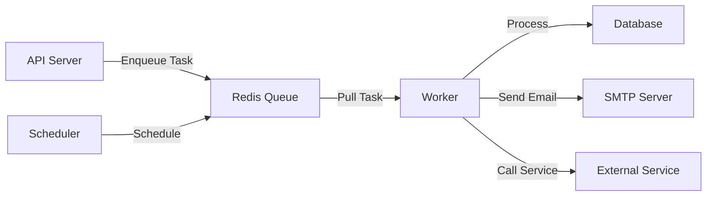
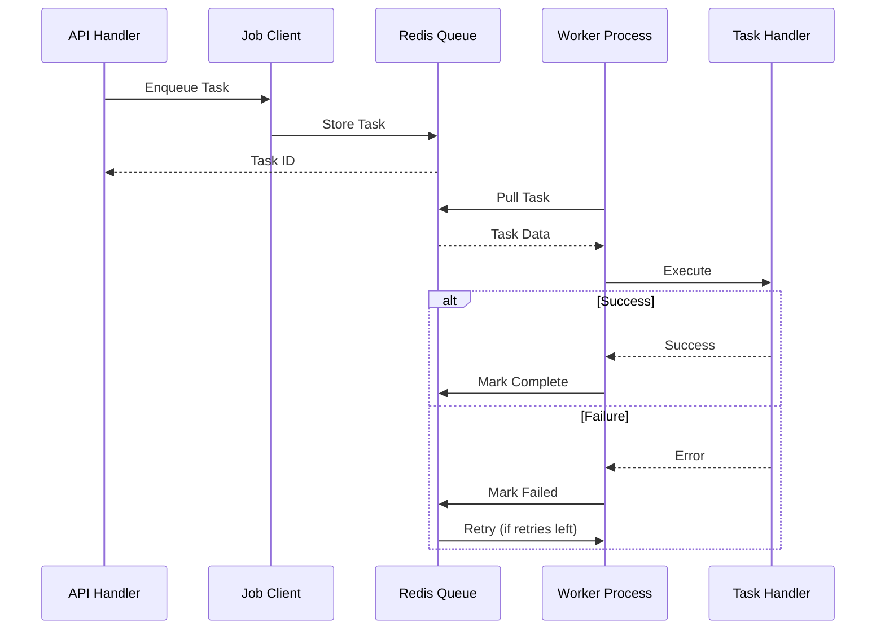

# Background Jobs Architecture

Overview of the background job processing system.

## Architecture

The system uses **Asynq** (Redis-backed task queue) for asynchronous job processing.

### Components



**Components**:
- **Client**: Enqueues tasks (used by API server)
- **Redis**: Task queue and storage
- **Worker**: Processes tasks from queue
- **Scheduler**: Schedules periodic tasks
- **Handlers**: Task-specific processing logic

## Queue System

### Queue Priority

```go
const (
    QueueCritical = "critical"  // High priority, processed first
    QueueDefault  = "default"   // Normal priority
    QueueLow      = "low"       // Low priority, background tasks
)
```

**Configuration**:

```go
// Worker configuration
asynq.Config{
    Concurrency: 10,  // Number of concurrent workers
    Queues: map[string]int{
        QueueCritical: 6,  // 60% of workers
        QueueDefault:  3,  // 30% of workers
        QueueLow:      1,  // 10% of workers
    },
}
```

### Task Lifecycle



## Worker Process

### Initialization

```go
// internal/jobs/worker.go
func NewWorker(cfg *config.Config, db *gorm.DB, logger *zap.Logger) (*Worker, error) {
    // Create Redis connection
    redisOpt := asynq.RedisClientOpt{
        Addr:     cfg.GetRedisAddr(),
        Password: cfg.Redis.Password,
        DB:       cfg.Redis.DB,
    }
    
    // Create server with config
    server := asynq.NewServer(
        redisOpt,
        asynq.Config{
            Concurrency: cfg.Asynq.Concurrency,
            Queues:      cfg.Asynq.Queues,
            ErrorHandler: asynq.ErrorHandlerFunc(errorHandler),
        },
    )
    
    // Register task handlers
    mux := asynq.NewServeMux()
    mux.HandleFunc(TypeTenantInitialization, handler1)
    mux.HandleFunc(TypeUserInvitation, handler2)
    mux.HandleFunc(TypeSystemUserExpiry, handler3)
    
    // Create scheduler for periodic tasks
    scheduler := asynq.NewScheduler(redisOpt, &asynq.SchedulerOpts{
        Logger: logger.Sugar(),
    })
    
    return &Worker{
        server:    server,
        mux:       mux,
        scheduler: scheduler,
    }, nil
}
```

### Running the Worker

```go
func (w *Worker) Start() error {
    // Start scheduler (periodic tasks)
    go func() {
        if err := w.scheduler.Run(); err != nil {
            log.Printf("Scheduler error: %v", err)
        }
    }()
    
    // Start worker (blocking)
    return w.server.Run(w.mux)
}
```

## Client Usage

### Enqueueing Tasks

```go
// From API handler
import "github.com/ysaakpr/rex/internal/jobs"

func (h *TenantHandler) CreateTenant(c *gin.Context) {
    // Create tenant
    tenant := createTenant()
    
    // Enqueue background task
    if err := h.jobClient.EnqueueTenantInitialization(tenant.ID); err != nil {
        logger.Error("Failed to enqueue task", zap.Error(err))
        // Continue - don't fail request if job fails to enqueue
    }
    
    c.JSON(200, gin.H{"data": tenant})
}
```

### Client Implementation

```go
// internal/jobs/client.go
type Client interface {
    EnqueueTenantInitialization(tenantID uuid.UUID) error
    EnqueueUserInvitation(invitationID uuid.UUID) error
    Close() error
}

func (c *client) EnqueueTenantInitialization(tenantID uuid.UUID) error {
    payload, _ := json.Marshal(map[string]interface{}{
        "tenant_id": tenantID.String(),
    })
    
    task := asynq.NewTask(TypeTenantInitialization, payload)
    
    _, err := c.asynqClient.Enqueue(
        task,
        asynq.Queue(QueueCritical),  // High priority
        asynq.MaxRetry(5),           // Retry up to 5 times
    )
    
    return err
}
```

## Task Handlers

### Handler Structure

```go
// internal/jobs/tasks/example.go
package tasks

type ExampleHandler struct {
    db     *gorm.DB
    cfg    *config.Config
    logger *zap.Logger
}

func NewExampleHandler(db *gorm.DB, cfg *config.Config) *ExampleHandler {
    return &ExampleHandler{db: db, cfg: cfg}
}

type ExamplePayload struct {
    ResourceID string `json:"resource_id"`
}

func (h *ExampleHandler) HandleExampleTask(ctx context.Context, task *asynq.Task) error {
    // 1. Parse payload
    var payload ExamplePayload
    if err := json.Unmarshal(task.Payload(), &payload); err != nil {
        return fmt.Errorf("failed to unmarshal payload: %w", err)
    }
    
    // 2. Validate input
    id, err := uuid.Parse(payload.ResourceID)
    if err != nil {
        return fmt.Errorf("invalid resource ID: %w", err)
    }
    
    // 3. Fetch resource
    var resource Resource
    if err := h.db.Where("id = ?", id).First(&resource).Error; err != nil {
        return fmt.Errorf("failed to get resource: %w", err)
    }
    
    // 4. Process
    if err := h.processResource(&resource); err != nil {
        return fmt.Errorf("failed to process: %w", err)
    }
    
    // 5. Update state
    return h.db.Model(&resource).Update("processed", true).Error
}
```

## Scheduler (Periodic Tasks)

### Scheduling Tasks

```go
// internal/jobs/worker.go
func setupScheduler(scheduler *asynq.Scheduler) error {
    // Run hourly
    _, err := scheduler.Register(
        "@hourly",
        asynq.NewTask(TypeSystemUserExpiry, nil),
        asynq.Queue(QueueLow),
    )
    
    // Run daily at 2 AM
    _, err = scheduler.Register(
        "0 2 * * *",  // Cron format
        asynq.NewTask(TypeDailyCleanup, nil),
        asynq.Queue(QueueLow),
    )
    
    // Run every 15 minutes
    _, err = scheduler.Register(
        "*/15 * * * *",
        asynq.NewTask(TypeHealthCheck, nil),
        asynq.Queue(QueueDefault),
    )
    
    return err
}
```

### Supported Cron Formats

```
┌───────────── minute (0 - 59)
│ ┌───────────── hour (0 - 23)
│ │ ┌───────────── day of month (1 - 31)
│ │ │ ┌───────────── month (1 - 12)
│ │ │ │ ┌───────────── day of week (0 - 6) (Sunday to Saturday)
│ │ │ │ │
│ │ │ │ │
* * * * *

Examples:
@hourly          - Every hour
@daily           - Every day at midnight
@weekly          - Every Sunday at midnight
@monthly         - First day of month at midnight
*/15 * * * *     - Every 15 minutes
0 2 * * *        - Every day at 2 AM
0 9-17 * * 1-5   - Every hour from 9 AM to 5 PM on weekdays
```

## Error Handling

### Retry Strategy

```go
// Enqueue with retry options
_, err := client.Enqueue(
    task,
    asynq.Queue(QueueDefault),
    asynq.MaxRetry(3),                           // Max 3 retries
    asynq.Timeout(5*time.Minute),                // Task timeout
    asynq.Retention(24*time.Hour),               // Keep completed for 24h
    asynq.ProcessIn(5*time.Second),              // Delay before processing
)
```

### Error Handler

```go
// Global error handler
ErrorHandler: asynq.ErrorHandlerFunc(func(ctx context.Context, task *asynq.Task, err error) {
    logger.Error("Task failed",
        zap.String("type", task.Type()),
        zap.Error(err),
        zap.Int("retried", task.ResultWriter().GetRetried()),
        zap.Int("max_retry", task.ResultWriter().GetMaxRetry()),
    )
    
    // Send alert for critical tasks
    if task.Type() == TypeTenantInitialization {
        alertAdmin("Critical task failed", err)
    }
}),
```

### Idempotency

Tasks should be idempotent (safe to retry):

```go
func (h *Handler) HandleTask(ctx context.Context, task *asynq.Task) error {
    // Check if already processed
    var processed bool
    h.db.Raw("SELECT EXISTS(SELECT 1 FROM processed_tasks WHERE task_id = ?)", 
        task.ResultWriter().TaskID()).Scan(&processed)
    
    if processed {
        return nil  // Already processed, skip
    }
    
    // Process task
    if err := h.process(); err != nil {
        return err
    }
    
    // Mark as processed
    h.db.Exec("INSERT INTO processed_tasks (task_id) VALUES (?)", 
        task.ResultWriter().TaskID())
    
    return nil
}
```

## Configuration

### Environment Variables

```bash
# Redis (required)
REDIS_HOST=localhost
REDIS_PORT=6379
REDIS_PASSWORD=
REDIS_DB=0

# Worker
ASYNQ_CONCURRENCY=10
ASYNQ_QUEUE_CRITICAL=6
ASYNQ_QUEUE_DEFAULT=3
ASYNQ_QUEUE_LOW=1

# Email (for invitation task)
EMAIL_PROVIDER=smtp
EMAIL_FROM_ADDRESS=noreply@example.com
SMTP_HOST=localhost
SMTP_PORT=1025
SMTP_USER=
SMTP_PASSWORD=

# Invitations
INVITATION_BASE_URL=http://localhost:3000/accept-invitation
```

### Config Struct

```go
// internal/config/config.go
type Config struct {
    Redis RedisConfig
    Asynq AsynqConfig
    Email EmailConfig
    Invitation InvitationConfig
}

type AsynqConfig struct {
    Concurrency int
    Queues      map[string]int
}
```

## Monitoring

### CLI Tool (Asynqmon)

```bash
# Install Asynqmon
go install github.com/hibiken/asynqmon@latest

# Run monitoring web UI
asynqmon --redis-addr=localhost:6379 --port=8081

# Open in browser
open http://localhost:8081
```

### Metrics

- Queue sizes
- Processing rates
- Failed tasks
- Retry counts
- Average processing time

### Logs

```bash
# View worker logs
make logs-worker

# Follow worker logs
docker logs -f utm-worker
```

## Best Practices

### 1. Keep Tasks Small
Break large operations into smaller tasks

### 2. Make Tasks Idempotent
Safe to retry without side effects

### 3. Use Appropriate Queues
- Critical: User-facing operations
- Default: Normal background jobs
- Low: Cleanup, analytics

### 4. Set Reasonable Timeouts
Prevent stuck tasks

### 5. Handle Partial Failures
Don't lose progress on retries

### 6. Log Extensively
Aid debugging and monitoring

### 7. Monitor Queue Depth
Detect and resolve bottlenecks

## Related Documentation

- [Available Jobs](/jobs/available-jobs) - List of all job types
- [Custom Jobs](/jobs/custom-jobs) - Creating new jobs
- [Job Monitoring](/jobs/monitoring) - Monitoring and debugging
