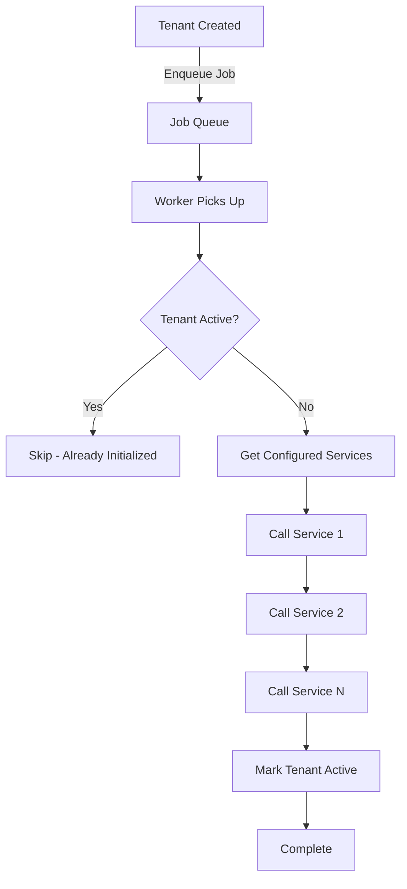
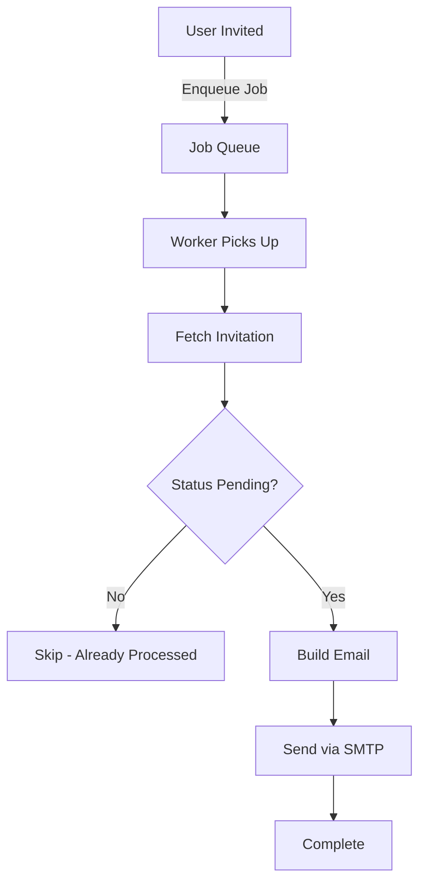
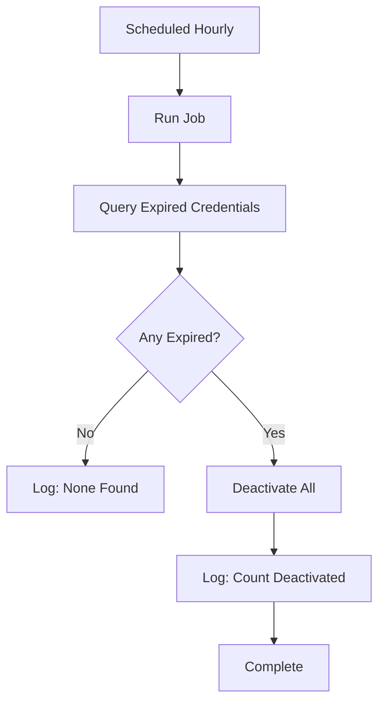

# Available Background Jobs

Complete list of all available background jobs.

## Job Types

The system currently supports 3 background job types:

| Job Type | Queue | Retries | Purpose |
|----------|-------|---------|---------|
| `tenant:initialize` | Critical | 5 | Initialize new tenants |
| `user:invitation` | Default | 3 | Send invitation emails |
| `system_user:expiry` | Low | N/A | Deactivate expired credentials |

---

## 1. Tenant Initialization

**Type**: `tenant:initialize`  
**Queue**: `critical` (high priority)  
**Retries**: 5  
**Trigger**: When new tenant is created

### Purpose

Initializes a new tenant across all backend services (multi-service architecture).

### Workflow



### Payload

```go
type TenantInitPayload struct {
    TenantID string `json:"tenant_id"`  // UUID of tenant
}
```

### Handler Details

**File**: `internal/jobs/tasks/tenant_init.go`

**Process**:
1. Parse tenant ID from payload
2. Fetch tenant from database
3. Check if already active (idempotent)
4. Get list of services from config
5. Call each service's `/api/v1/tenants/initialize` endpoint
6. Mark tenant as `active`

### Service Request

Each service receives:

```json
{
  "tenant_id": "uuid",
  "tenant_name": "Acme Corp",
  "tenant_slug": "acme-corp",
  "metadata": {},
  "created_at": "2024-11-25T10:00:00Z"
}
```

### Configuration

```bash
# .env
TENANT_INIT_SERVICES=http://service1:8080,http://service2:8081
```

```go
// config.go
type TenantInitConfig struct {
    Services []string  // List of service URLs
}
```

### Error Handling

- **Retry**: Up to 5 times with exponential backoff
- **Timeout**: 30 seconds per service
- **Failure**: If any service fails, job is retried
- **Logging**: All failures are logged

### Usage Example

```go
// In tenant creation handler
func (h *TenantHandler) CreateTenant(c *gin.Context) {
    // Create tenant in database
    tenant, err := h.tenantService.Create(c, input)
    if err != nil {
        return err
    }
    
    // Enqueue initialization job
    if err := h.jobClient.EnqueueTenantInitialization(tenant.ID); err != nil {
        logger.Error("Failed to enqueue tenant init", zap.Error(err))
        // Don't fail the request - tenant created successfully
    }
    
    c.JSON(201, gin.H{"data": tenant})
}
```

### Monitoring

```bash
# Check if job completed
docker logs utm-worker | grep "tenant:initialize"

# Expected output:
# Starting tenant initialization for tenant: <uuid>
# Successfully initialized tenant in service: http://...
# Successfully marked tenant as active: <uuid>
```

---

## 2. User Invitation Email

**Type**: `user:invitation`  
**Queue**: `default` (normal priority)  
**Retries**: 3  
**Trigger**: When user is invited to tenant

### Purpose

Sends invitation email to invited users with acceptance link.

### Workflow



### Payload

```go
type InvitationPayload struct {
    InvitationID string `json:"invitation_id"`  // UUID of invitation
}
```

### Handler Details

**File**: `internal/jobs/tasks/invitation.go`

**Process**:
1. Parse invitation ID from payload
2. Fetch invitation with tenant and role (preloaded)
3. Check if still pending (idempotent)
4. Build invitation email
5. Send via configured email provider
6. Log result

### Email Content

```
Subject: You've been invited to join Acme Corp

Hello,

You have been invited to join Acme Corp on our platform.

Role: Editor

Please click the link below to accept your invitation:
http://localhost:3000/accept-invitation?token=abc123...

This invitation will expire on: Nov 30, 2024 at 11:59 PM

If you didn't expect this invitation, you can safely ignore this email.

Best regards,
The Team
```

### Email Providers

#### Development (Console)

```bash
EMAIL_PROVIDER=console
```

Emails are logged to console instead of sent.

#### SMTP

```bash
EMAIL_PROVIDER=smtp
EMAIL_FROM_ADDRESS=noreply@example.com
SMTP_HOST=localhost
SMTP_PORT=1025
SMTP_USER=
SMTP_PASSWORD=
```

#### MailHog (Local Development)

```bash
# Already configured in docker-compose.yml
# View emails at: http://localhost:8025
```

### Configuration

```bash
# .env
EMAIL_PROVIDER=smtp
EMAIL_FROM_ADDRESS=noreply@example.com
SMTP_HOST=mailhog
SMTP_PORT=1025
INVITATION_BASE_URL=http://localhost:3000/accept-invitation
```

### Error Handling

- **Retry**: Up to 3 times
- **Timeout**: 30 seconds
- **SMTP Failure**: Job fails and retries
- **Invalid Invitation**: Job succeeds (logged as skipped)

### Usage Example

```go
// In invitation creation handler
func (h *InvitationHandler) CreateInvitation(c *gin.Context) {
    // Create invitation
    invitation, err := h.invitationService.Create(c, input)
    if err != nil {
        return err
    }
    
    // Enqueue email job
    if err := h.jobClient.EnqueueUserInvitation(invitation.ID); err != nil {
        logger.Error("Failed to enqueue invitation", zap.Error(err))
    }
    
    c.JSON(201, gin.H{"data": invitation})
}
```

### Monitoring

```bash
# Check email jobs
docker logs utm-worker | grep "user:invitation"

# View sent emails (MailHog)
open http://localhost:8025

# Expected output:
# Processing invitation email for invitation: <uuid>
# Successfully sent invitation email to: user@example.com
```

---

## 3. System User Expiry

**Type**: `system_user:expiry`  
**Queue**: `low` (low priority)  
**Retries**: N/A (periodic task)  
**Trigger**: Scheduled (hourly)

### Purpose

Automatically deactivates expired system user credentials.

### Workflow



### Payload

None (scheduled periodic task).

### Handler Details

**File**: `internal/jobs/tasks/system_user_expiry_task.go`

**Process**:
1. Query for expired active credentials
2. Batch deactivate using SQL UPDATE
3. Log count of deactivated credentials

### SQL Query

```sql
UPDATE system_users
SET is_active = false
WHERE expires_at IS NOT NULL
  AND expires_at < NOW()
  AND is_active = true
```

### Schedule

```go
// Runs every hour
scheduler.Register(
    "@hourly",  // Cron: 0 * * * *
    asynq.NewTask(TypeSystemUserExpiry, nil),
    asynq.Queue(QueueLow),
)
```

### Configuration

No configuration needed - runs automatically when worker starts.

### Logging

```go
// Success (with deactivations)
logger.Info("Deactivated expired credentials", 
    zap.Int64("count", 5))

// Success (no expirations)
logger.Debug("No expired credentials found")

// Error
logger.Error("Failed to deactivate expired credentials",
    zap.Error(err))
```

### Monitoring

```bash
# Check expiry job logs
docker logs utm-worker | grep "system_user:expiry"

# Expected output (hourly):
# Starting system user expiry job
# Deactivated expired credentials count=5
# or
# No expired credentials found
```

### Grace Period

System users can be created with a grace period warning:

```go
// Create system user expiring in 90 days with 7-day grace period
systemUser := &models.SystemUser{
    ExpiresAt:     &expiresAt,     // 90 days from now
    GracePeriodAt: &gracePeriod,   // 83 days from now
}
```

The expiry job:
- Sends warning when `grace_period_at` is reached
- Deactivates when `expires_at` is reached

---

## Job States

### Task States

- **Pending**: Waiting in queue
- **Active**: Being processed
- **Completed**: Successfully finished
- **Failed**: Error occurred (will retry if retries left)
- **Archived**: Completed and retained
- **Scheduled**: Waiting for scheduled time

### Viewing States

Use Asynqmon web UI:

```bash
# Start monitoring UI
asynqmon --redis-addr=localhost:6379 --port=8081

# Open
open http://localhost:8081
```

---

## Queue Configuration

### Default Configuration

```go
// internal/jobs/worker.go
asynq.Config{
    Concurrency: 10,  // 10 concurrent workers
    Queues: map[string]int{
        QueueCritical: 6,  // 60% capacity
        QueueDefault:  3,  // 30% capacity
        QueueLow:      1,  // 10% capacity
    },
}
```

### Customizing

```bash
# Environment variables
ASYNQ_CONCURRENCY=20
ASYNQ_QUEUE_CRITICAL=12
ASYNQ_QUEUE_DEFAULT=6
ASYNQ_QUEUE_LOW=2
```

---

## Testing Jobs

### Manual Trigger

```go
// In a test or admin script
package main

import (
    "github.com/google/uuid"
    "github.com/ysaakpr/rex/internal/jobs"
)

func main() {
    client, _ := jobs.NewClient("localhost:6379", "")
    
    // Trigger tenant init
    tenantID := uuid.MustParse("tenant-uuid")
    client.EnqueueTenantInitialization(tenantID)
    
    // Trigger invitation
    invitationID := uuid.MustParse("invitation-uuid")
    client.EnqueueUserInvitation(invitationID)
}
```

### Testing Locally

```bash
# 1. Start services
make run

# 2. Create a tenant (triggers job)
curl -X POST http://localhost:8080/api/v1/tenants \
  -H "Content-Type: application/json" \
  -d '{"name":"Test Tenant","slug":"test-tenant"}'

# 3. Check worker logs
make logs-worker

# 4. View sent emails
open http://localhost:8025  # MailHog UI
```

---

## Performance

### Throughput

- **Critical Queue**: ~100 tasks/minute
- **Default Queue**: ~200 tasks/minute  
- **Low Queue**: ~50 tasks/minute

### Latency

- **Queue to Start**: < 1 second (typically)
- **Tenant Init**: 5-30 seconds (depends on services)
- **Invitation Email**: 1-5 seconds
- **System User Expiry**: 1-10 seconds (depends on volume)

### Scaling

To handle more load:

```bash
# Increase concurrency
ASYNQ_CONCURRENCY=50

# Or run multiple worker instances
docker-compose up --scale worker=3
```

---

## Related Documentation

- [Jobs Architecture](/jobs/architecture) - System design
- [Custom Jobs](/jobs/custom-jobs) - Creating new jobs
- [Job Monitoring](/jobs/monitoring) - Monitoring and debugging
