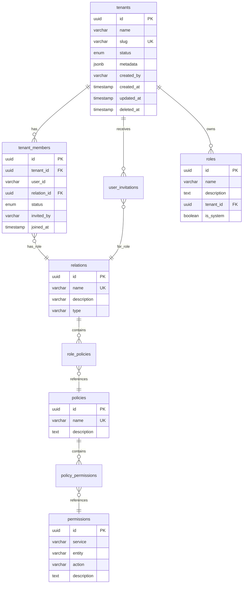

# Database Schema Reference

Complete reference for all database tables and relationships.

## Overview

The system uses PostgreSQL with the following schema structure:

**Core Tables**: Tenants, Users, Members  
**RBAC Tables**: Roles, Policies, Permissions, Assignments  
**Auth Tables**: System Users, Platform Admins, Invitations  
**Metadata**: Relations

## Entity Relationship Diagram



## Core Tables

### tenants

Primary table for multi-tenant isolation.

**Columns**:
| Column | Type | Constraints | Description |
|--------|------|-------------|-------------|
| `id` | UUID | PRIMARY KEY | Unique tenant identifier |
| `name` | VARCHAR(255) | NOT NULL | Display name |
| `slug` | VARCHAR(255) | UNIQUE, NOT NULL | URL-friendly identifier |
| `status` | tenant_status | NOT NULL, DEFAULT 'pending' | Tenant status |
| `metadata` | JSONB | DEFAULT '{}' | Custom metadata |
| `created_by` | VARCHAR(255) | NOT NULL | SuperTokens user ID of creator |
| `created_at` | TIMESTAMPTZ | DEFAULT NOW() | Creation timestamp |
| `updated_at` | TIMESTAMPTZ | DEFAULT NOW() | Last update timestamp |
| `deleted_at` | TIMESTAMPTZ | NULL | Soft delete timestamp |

**Enum**: `tenant_status`
```sql
'pending'   -- Awaiting initialization
'active'    -- Fully operational
'suspended' -- Temporarily disabled
'deleted'   -- Soft deleted
```

**Indexes**:
- `idx_tenants_slug` ON `(slug)`
- `idx_tenants_created_by` ON `(created_by)`
- `idx_tenants_status` ON `(status)`
- `idx_tenants_deleted_at` ON `(deleted_at)`

**Example**:
```sql
INSERT INTO tenants (name, slug, created_by, status)
VALUES ('Acme Corp', 'acme-corp', 'user-uuid', 'active');
```

### tenant_members

Links users to tenants with roles.

**Columns**:
| Column | Type | Constraints | Description |
|--------|------|-------------|-------------|
| `id` | UUID | PRIMARY KEY | Member record ID |
| `tenant_id` | UUID | FK → tenants(id), NOT NULL | Tenant reference |
| `user_id` | VARCHAR(255) | NOT NULL | SuperTokens user ID |
| `relation_id` | UUID | FK → relations(id), NOT NULL | Role/relation reference |
| `status` | member_status | NOT NULL, DEFAULT 'active' | Membership status |
| `invited_by` | VARCHAR(255) | NULL | Who invited this member |
| `joined_at` | TIMESTAMPTZ | DEFAULT NOW() | When user joined |
| `created_at` | TIMESTAMPTZ | DEFAULT NOW() | Record creation |
| `updated_at` | TIMESTAMPTZ | DEFAULT NOW() | Last update |

**Enum**: `member_status`
```sql
'active'   -- Active member
'inactive' -- Deactivated member
'pending'  -- Invitation not yet accepted
```

**Constraints**:
- `UNIQUE(tenant_id, user_id)` - One membership per user per tenant
- `ON DELETE CASCADE` - Delete members when tenant deleted

**Indexes**:
- `idx_tenant_members_tenant_id` ON `(tenant_id)`
- `idx_tenant_members_user_id` ON `(user_id)`
- `idx_tenant_members_relation_id` ON `(relation_id)`
- `idx_tenant_members_status` ON `(status)`

**Example**:
```sql
INSERT INTO tenant_members (tenant_id, user_id, relation_id, invited_by)
VALUES ('tenant-uuid', 'user-uuid', 'relation-uuid', 'admin-user-uuid');
```

### relations

Represents tenant-level user types (roles).

**Columns**:
| Column | Type | Constraints | Description |
|--------|------|-------------|-------------|
| `id` | UUID | PRIMARY KEY | Relation ID |
| `name` | VARCHAR(100) | UNIQUE, NOT NULL | Relation name |
| `description` | TEXT | NULL | Description |
| `type` | VARCHAR(50) | DEFAULT 'tenant' | Relation type |
| `created_at` | TIMESTAMPTZ | DEFAULT NOW() | Creation time |
| `updated_at` | TIMESTAMPTZ | DEFAULT NOW() | Update time |

**Standard Relations**:
```sql
INSERT INTO relations (name, description, type) VALUES
('Admin', 'Full tenant administration', 'tenant'),
('Writer', 'Content creation and editing', 'tenant'),
('Viewer', 'Read-only access', 'tenant'),
('Basic', 'Basic tenant access', 'tenant');
```

**Indexes**:
- `idx_relations_name` ON `(name)`
- `idx_relations_type` ON `(type)`

## RBAC Tables

### roles

Platform and tenant-specific roles.

**Columns**:
| Column | Type | Constraints | Description |
|--------|------|-------------|-------------|
| `id` | UUID | PRIMARY KEY | Role ID |
| `name` | VARCHAR(100) | NOT NULL | Role name |
| `description` | TEXT | NULL | Description |
| `tenant_id` | UUID | FK → tenants(id), NULL | NULL for platform roles |
| `is_system` | BOOLEAN | DEFAULT false | System-defined role |
| `created_at` | TIMESTAMPTZ | DEFAULT NOW() | Creation time |
| `updated_at` | TIMESTAMPTZ | DEFAULT NOW() | Update time |

**Constraints**:
- `UNIQUE(name, tenant_id)` - Unique name per scope
- `ON DELETE CASCADE` - Delete with tenant

**Indexes**:
- `idx_roles_tenant_id` ON `(tenant_id)`
- `idx_roles_is_system` ON `(is_system)`

### policies

Collections of permissions.

**Columns**:
| Column | Type | Constraints | Description |
|--------|------|-------------|-------------|
| `id` | UUID | PRIMARY KEY | Policy ID |
| `name` | VARCHAR(255) | UNIQUE, NOT NULL | Policy name |
| `description` | TEXT | NULL | Description |
| `created_at` | TIMESTAMPTZ | DEFAULT NOW() | Creation time |
| `updated_at` | TIMESTAMPTZ | DEFAULT NOW() | Update time |

**Example**:
```sql
INSERT INTO policies (name, description) VALUES
('Tenant Management', 'Manage tenant settings and members'),
('Content Creation', 'Create and edit content');
```

### permissions

Atomic authorization units.

**Columns**:
| Column | Type | Constraints | Description |
|--------|------|-------------|-------------|
| `id` | UUID | PRIMARY KEY | Permission ID |
| `service` | VARCHAR(100) | NOT NULL | Service name |
| `entity` | VARCHAR(100) | NOT NULL | Resource type |
| `action` | VARCHAR(100) | NOT NULL | Action name |
| `description` | TEXT | NULL | Description |
| `created_at` | TIMESTAMPTZ | DEFAULT NOW() | Creation time |
| `updated_at` | TIMESTAMPTZ | DEFAULT NOW() | Update time |

**Constraints**:
- `UNIQUE(service, entity, action)` - Unique permission key

**Indexes**:
- `idx_permissions_service` ON `(service)`
- `idx_permissions_key` ON `(service, entity, action)`

**Example**:
```sql
INSERT INTO permissions (service, entity, action, description) VALUES
('tenant-api', 'tenant', 'update', 'Update tenant settings'),
('blog-api', 'post', 'create', 'Create blog posts');
```

### role_policies

Maps roles to policies (many-to-many).

**Columns**:
| Column | Type | Constraints | Description |
|--------|------|-------------|-------------|
| `role_id` | UUID | FK → roles(id), NOT NULL | Role reference |
| `policy_id` | UUID | FK → policies(id), NOT NULL | Policy reference |

**Constraints**:
- `PRIMARY KEY (role_id, policy_id)`
- `ON DELETE CASCADE` - Delete mappings with role or policy

**Indexes**:
- `idx_role_policies_role_id` ON `(role_id)`
- `idx_role_policies_policy_id` ON `(policy_id)`

### policy_permissions

Maps policies to permissions (many-to-many).

**Columns**:
| Column | Type | Constraints | Description |
|--------|------|-------------|-------------|
| `policy_id` | UUID | FK → policies(id), NOT NULL | Policy reference |
| `permission_id` | UUID | FK → permissions(id), NOT NULL | Permission reference |

**Constraints**:
- `PRIMARY KEY (policy_id, permission_id)`
- `ON DELETE CASCADE` - Delete mappings with policy or permission

**Indexes**:
- `idx_policy_permissions_policy_id` ON `(policy_id)`
- `idx_policy_permissions_permission_id` ON `(permission_id)`

## Authentication Tables

### user_invitations

Invitations to join tenants.

**Columns**:
| Column | Type | Constraints | Description |
|--------|------|-------------|-------------|
| `id` | UUID | PRIMARY KEY | Invitation ID |
| `tenant_id` | UUID | FK → tenants(id), NOT NULL | Target tenant |
| `email` | VARCHAR(255) | NOT NULL | Invitee email |
| `relation_id` | UUID | FK → relations(id), NOT NULL | Assigned role |
| `token` | VARCHAR(255) | UNIQUE, NOT NULL | Acceptance token |
| `status` | invitation_status | NOT NULL, DEFAULT 'pending' | Invitation status |
| `invited_by` | VARCHAR(255) | NOT NULL | Inviter user ID |
| `expires_at` | TIMESTAMPTZ | NOT NULL | Expiration time |
| `accepted_at` | TIMESTAMPTZ | NULL | Acceptance time |
| `created_at` | TIMESTAMPTZ | DEFAULT NOW() | Creation time |
| `updated_at` | TIMESTAMPTZ | DEFAULT NOW() | Update time |

**Enum**: `invitation_status`
```sql
'pending'   -- Awaiting acceptance
'accepted'  -- User accepted
'expired'   -- Past expiration
'cancelled' -- Cancelled by admin
```

**Indexes**:
- `idx_user_invitations_tenant_id` ON `(tenant_id)`
- `idx_user_invitations_email` ON `(email)`
- `idx_user_invitations_token` ON `(token)`
- `idx_user_invitations_status` ON `(status)`

### system_users

Machine-to-machine authentication credentials.

**Columns**:
| Column | Type | Constraints | Description |
|--------|------|-------------|-------------|
| `id` | UUID | PRIMARY KEY | System user ID |
| `name` | VARCHAR(255) | NOT NULL | Credential name |
| `description` | TEXT | NULL | Description |
| `token_hash` | VARCHAR(255) | UNIQUE, NOT NULL | Hashed token |
| `is_active` | BOOLEAN | NOT NULL, DEFAULT true | Active status |
| `expires_at` | TIMESTAMPTZ | NULL | Expiration time |
| `grace_period_at` | TIMESTAMPTZ | NULL | Grace period start |
| `last_used_at` | TIMESTAMPTZ | NULL | Last usage time |
| `created_by` | VARCHAR(255) | NOT NULL | Creator user ID |
| `created_at` | TIMESTAMPTZ | DEFAULT NOW() | Creation time |
| `updated_at` | TIMESTAMPTZ | DEFAULT NOW() | Update time |

**Indexes**:
- `idx_system_users_token_hash` ON `(token_hash)`
- `idx_system_users_is_active` ON `(is_active)`
- `idx_system_users_expires_at` ON `(expires_at)`

### platform_admins

Platform administrator access.

**Columns**:
| Column | Type | Constraints | Description |
|--------|------|-------------|-------------|
| `id` | UUID | PRIMARY KEY | Record ID |
| `user_id` | VARCHAR(255) | UNIQUE, NOT NULL | SuperTokens user ID |
| `granted_by` | VARCHAR(255) | NULL | Who granted access |
| `granted_at` | TIMESTAMPTZ | DEFAULT NOW() | When granted |
| `is_active` | BOOLEAN | NOT NULL, DEFAULT true | Active status |
| `created_at` | TIMESTAMPTZ | DEFAULT NOW() | Creation time |
| `updated_at` | TIMESTAMPTZ | DEFAULT NOW() | Update time |

**Indexes**:
- `idx_platform_admins_user_id` ON `(user_id)`
- `idx_platform_admins_is_active` ON `(is_active)`

## Common Queries

### Get User's Tenants

```sql
SELECT t.*
FROM tenants t
INNER JOIN tenant_members tm ON t.id = tm.tenant_id
WHERE tm.user_id = 'user-uuid'
  AND tm.status = 'active'
  AND t.status = 'active';
```

### Get User's Permissions in Tenant

```sql
SELECT DISTINCT p.*
FROM permissions p
INNER JOIN policy_permissions pp ON p.id = pp.permission_id
INNER JOIN policies pol ON pp.policy_id = pol.id
INNER JOIN role_policies rp ON pol.id = rp.policy_id
INNER JOIN roles r ON rp.role_id = r.id
INNER JOIN relations rel ON r.name = rel.name
INNER JOIN tenant_members tm ON rel.id = tm.relation_id
WHERE tm.user_id = 'user-uuid'
  AND tm.tenant_id = 'tenant-uuid'
  AND tm.status = 'active';
```

### Check Specific Permission

```sql
SELECT EXISTS(
  SELECT 1
  FROM permissions p
  INNER JOIN policy_permissions pp ON p.id = pp.permission_id
  INNER JOIN role_policies rp ON pp.policy_id = rp.policy_id
  INNER JOIN roles r ON rp.role_id = r.id
  INNER JOIN relations rel ON r.name = rel.name
  INNER JOIN tenant_members tm ON rel.id = tm.relation_id
  WHERE tm.user_id = 'user-uuid'
    AND tm.tenant_id = 'tenant-uuid'
    AND tm.status = 'active'
    AND p.service = 'blog-api'
    AND p.entity = 'post'
    AND p.action = 'create'
) AS has_permission;
```

## Migration Management

Migrations are managed using `golang-migrate`:

```bash
# Create new migration
migrate create -ext sql -dir migrations -seq migration_name

# Apply migrations
migrate -path migrations -database "postgresql://..." up

# Rollback last migration
migrate -path migrations -database "postgresql://..." down 1

# Check current version
migrate -path migrations -database "postgresql://..." version
```

## Related Documentation

- [Glossary](/reference/glossary) - Term definitions
- [Error Codes](/reference/error-codes) - API error reference
- [API Overview](/x-api/overview) - API structure
