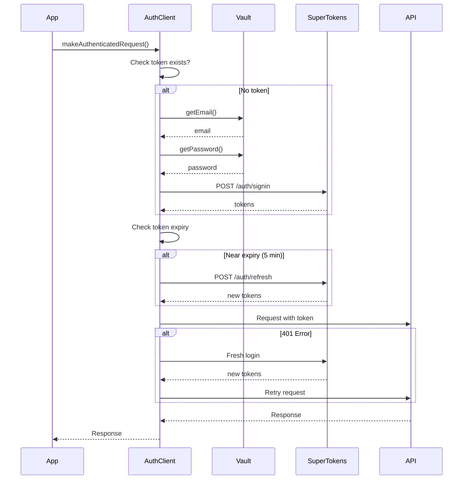

# System Auth Library Overview

A reusable authentication library for System Users (M2M - Machine to Machine) that handles the complete authentication lifecycle.

## What is the System Auth Library?

The System Auth Library is a client library that simplifies authentication for background services, workers, and integrations. It handles:

- ✅ **Automatic Login** - Authenticates on first API call
- ✅ **Token Management** - Stores and refreshes tokens automatically
- ✅ **Auto Refresh** - Refreshes tokens before expiry
- ✅ **Retry Logic** - Re-authenticates on 401 errors
- ✅ **Pluggable Secrets** - Vault interface for credential storage
- ✅ **Thread-Safe** - Safe for concurrent use

## Why Use This Library?

### Without the Library ❌

```java
// Manual authentication code
String email = System.getenv("EMAIL");
String password = System.getenv("PASSWORD");

// Login request
HttpResponse loginResp = http.post("/auth/signin", 
    Map.of("email", email, "password", password));
String accessToken = loginResp.header("st-access-token");

// Make API call
HttpResponse response = http.get("/api/v1/tenants")
    .header("Authorization", "Bearer " + accessToken)
    .send();

// Token expired? Need to refresh manually
if (response.status() == 401) {
    // Refresh logic...
    // Retry request...
}
```

### With the Library ✅

```java
// One-time setup
SystemAuthClient client = new SystemAuthClient(config);

// Just make requests - authentication is automatic
Response response = client.makeAuthenticatedRequest(
    "GET", "/api/v1/tenants", null
);
```

## Key Features

### 1. Pluggable Credential Storage

Use different secret stores without changing your application code:

```
Vault Interface
    ↓
├─ EnvVault (default) - Environment variables
├─ AWSSecretsVault - AWS Secrets Manager
├─ HashiCorpVault - HashiCorp Vault
├─ AzureKeyVault - Azure Key Vault
└─ Custom Implementation - Your own vault
```

### 2. Automatic Token Lifecycle

```
Initial State: No tokens
    ↓
First API Call
    ↓
Automatic Login
    ↓
Store Tokens
    ↓
Subsequent Calls
    ↓
Check Expiry (5 min buffer)
    ↓
Refresh if Needed
    ↓
API Call with Fresh Token
```

### 3. Error Recovery

```
API Call Returns 401
    ↓
Token might be invalid
    ↓
Attempt Token Refresh
    ↓
Refresh Failed (401)?
    ↓
Fresh Login
    ↓
Retry Original Request
```

### 4. Thread Safety

Multiple threads can safely use the same client instance:

```go
// Go example
var authClient *SystemAuthClient

func init() {
    authClient = NewSystemAuthClient(config)
}

// Safe from multiple goroutines
go worker1(authClient)
go worker2(authClient)
go worker3(authClient)
```

## Architecture

### Component Diagram

```
┌─────────────────────────────────────────┐
│         Your Application                 │
│  ┌─────────────────────────────────┐   │
│  │   SystemAuthClient              │   │
│  │  ┌──────────────────────────┐  │   │
│  │  │  Token Manager           │  │   │
│  │  │  - accessToken           │  │   │
│  │  │  - refreshToken          │  │   │
│  │  │  - expiry                │  │   │
│  │  └──────────────────────────┘  │   │
│  │  ┌──────────────────────────┐  │   │
│  │  │  Vault Interface         │  │   │
│  │  │  - getEmail()            │  │   │
│  │  │  - getPassword()         │  │   │
│  │  └──────────────────────────┘  │   │
│  └─────────────────────────────────┘   │
└─────────────────────────────────────────┘
           │
           ↓
    ┌─────────────────┐
    │  SuperTokens    │
    │  /auth/signin   │
    │  /auth/refresh  │
    └─────────────────┘
           │
           ↓
    ┌─────────────────┐
    │   Your API      │
    │  /api/v1/*      │
    └─────────────────┘
```

### Flow Diagram



## Vault Interface

The heart of the library is the pluggable vault interface:

### Interface Definition

**Go**:
```go
type SecretVault interface {
    GetEmail() (string, error)
    GetPassword() (string, error)
}
```

**Java**:
```java
public interface SecretVault {
    String getEmail() throws Exception;
    String getPassword() throws Exception;
}
```

### Default Implementation: Environment Variables

**Go**:
```go
type EnvVault struct {
    EmailEnvKey    string
    PasswordEnvKey string
}

func (v *EnvVault) GetEmail() (string, error) {
    email := os.Getenv(v.EmailEnvKey)
    if email == "" {
        return "", fmt.Errorf("email not found in env")
    }
    return email, nil
}
```

**Java**:
```java
public class EnvVault implements SecretVault {
    private final String emailEnvKey;
    private final String passwordEnvKey;
    
    @Override
    public String getEmail() throws Exception {
        String email = System.getenv(emailEnvKey);
        if (email == null) {
            throw new Exception("Email not found in environment");
        }
        return email;
    }
}
```

## Available Implementations

### Go

- **[Full Go Documentation](/system-auth/go)**
- EnvVault (built-in)
- Example: AWS Secrets Manager
- Example: HashiCorp Vault

### Java

- **[Full Java Documentation](/system-auth/java)**
- EnvVault (built-in)
- Example: AWS Secrets Manager
- Example: Azure Key Vault

## Quick Start

### Go

```go
package main

import (
    "github.com/yourorg/systemauth"
)

func main() {
    // Use environment variables
    vault := systemauth.NewEnvVault(
        "SYSTEM_USER_EMAIL", 
        "SYSTEM_USER_PASSWORD"
    )
    
    client := systemauth.NewSystemAuthClient(systemauth.SystemAuthConfig{
        Vault:  vault,
        APIURL: "https://api.yourdomain.com",
    })
    
    // Make authenticated requests
    resp, err := client.MakeAuthenticatedRequest(
        "GET", 
        "https://api.yourdomain.com/api/v1/tenants", 
        nil,
    )
    // Authentication is automatic!
}
```

### Java

```java
public class Main {
    public static void main(String[] args) {
        // Use environment variables
        SecretVault vault = new EnvVault(
            "SYSTEM_USER_EMAIL", 
            "SYSTEM_USER_PASSWORD"
        );
        
        SystemAuthClient.Config config = new SystemAuthClient.Config();
        config.vault = vault;
        config.apiUrl = "https://api.yourdomain.com";
        
        SystemAuthClient client = new SystemAuthClient(config);
        
        // Make authenticated requests
        Response response = client.makeAuthenticatedRequest(
            "GET",
            "https://api.yourdomain.com/api/v1/tenants",
            null
        );
        // Authentication is automatic!
    }
}
```

## Configuration Options

### Refresh Buffer

How long before token expiry to refresh:

**Go**:
```go
config := SystemAuthConfig{
    Vault:         vault,
    APIURL:        apiURL,
    RefreshBuffer: 5 * time.Minute, // Refresh 5 minutes before expiry
}
```

**Java**:
```java
config.refreshBufferSeconds = 300; // 5 minutes
```

### HTTP Timeout

Set request timeout:

**Go**:
```go
// Customize HTTP client
client := &SystemAuthClient{
    httpClient: &http.Client{
        Timeout: 30 * time.Second,
    },
}
```

**Java**:
```java
// OkHttpClient is customizable
OkHttpClient httpClient = new OkHttpClient.Builder()
    .connectTimeout(30, TimeUnit.SECONDS)
    .readTimeout(30, TimeUnit.SECONDS)
    .build();
```

## Use Cases

### Background Worker

Processes tenant data periodically:

```go
func workerLoop() {
    authClient := setupAuthClient()
    
    for {
        // Fetch work
        resp, _ := authClient.MakeAuthenticatedRequest(
            "GET", apiURL+"/api/v1/jobs/pending", nil,
        )
        
        // Process jobs...
        
        time.Sleep(10 * time.Second)
    }
}
```

### Scheduled Job (Cron)

Runs on a schedule:

```java
@Scheduled(fixedRate = 3600000) // Every hour
public void scheduledTask() {
    Response response = authClient.makeAuthenticatedRequest(
        "POST", apiUrl + "/api/v1/reports/generate", null
    );
    // Process response...
}
```

### Integration Service

Syncs data between systems:

```go
func syncData() {
    // Get data from external system
    externalData := fetchFromExternalAPI()
    
    // Send to your API (authentication automatic)
    resp, err := authClient.MakeAuthenticatedRequest(
        "POST",
        apiURL+"/api/v1/import",
        bytes.NewBuffer(externalData),
    )
}
```

### Data Pipeline

Part of data processing pipeline:

```java
public class DataPipeline {
    private SystemAuthClient authClient;
    
    public void processData(Data data) {
        // Transform data
        String json = transformToJson(data);
        
        // Send to API (authentication automatic)
        Response response = authClient.makeAuthenticatedRequest(
            "POST",
            apiUrl + "/api/v1/data",
            json
        );
    }
}
```

## Security Best Practices

### 1. Credential Storage

**Development**:
```bash
# .env file
SYSTEM_USER_EMAIL=worker@system.internal
SYSTEM_USER_PASSWORD=dev_password_123
```

**Production**:
```bash
# Use a secret manager
vault = new AWSSecretsVault("prod/worker-credentials", "us-east-1")
```

### 2. Credential Rotation

Rotate credentials periodically:

```bash
# Every 90 days
POST /api/v1/platform/system-users/{id}/rotate
{
  "grace_period_days": 7
}
```

### 3. Least Privilege

Only grant necessary permissions to system users.

### 4. Monitoring

Log authentication events:

```go
log.Printf("System user %s authenticated", serviceName)
```

### 5. Network Security

- Use HTTPS only in production
- Restrict network access to services
- Use VPN or private networks when possible

## Performance Considerations

### Token Caching

Tokens are cached in memory:
- Access token: Valid for 24 hours
- Refresh token: Used to get new access tokens
- No need for repeated logins

### Connection Pooling

HTTP clients use connection pooling:
- Reuses connections
- Reduces latency
- Better throughput

### Concurrency

Library is thread-safe:
- Multiple threads/goroutines can use same client
- Internal locking prevents race conditions
- One login per client instance

## Troubleshooting

### "Failed to get credentials from vault"

**Cause**: Environment variables not set or vault unavailable

**Solution**:
```bash
# Check environment variables
echo $SYSTEM_USER_EMAIL
echo $SYSTEM_USER_PASSWORD

# Or check vault connectivity
```

### "Login failed with status 401"

**Cause**: Invalid credentials

**Solution**:
- Verify system user exists
- Check credentials are correct
- Ensure system user is active

### "Token refresh failed"

**Cause**: Refresh token expired

**Solution**: Library automatically re-logs in

### "Request timeout"

**Cause**: API not responding

**Solution**:
- Check API is running
- Increase timeout
- Check network connectivity

## Comparison with Other Solutions

| Feature | System Auth Library | Manual Auth | Service Mesh |
|---------|---------------------|-------------|--------------|
| Easy to use | ✅ Very | ❌ Complex | ✅ Yes |
| Token management | ✅ Automatic | ❌ Manual | ✅ Automatic |
| Pluggable secrets | ✅ Yes | ❌ No | ⚠️ Limited |
| Language support | ⚠️ Go, Java | ✅ Any | ✅ Any |
| Infrastructure | ✅ None needed | ✅ None | ❌ Complex |
| Learning curve | ✅ Low | ❌ High | ❌ High |

## Next Steps

- **[Go Implementation](/system-auth/go)** - Complete Go library
- **[Java Implementation](/system-auth/java)** - Complete Java library
- **[Custom Vaults](/system-auth/custom-vaults)** - Implement your own vault
- **[Usage Examples](/system-auth/usage)** - Real-world examples

