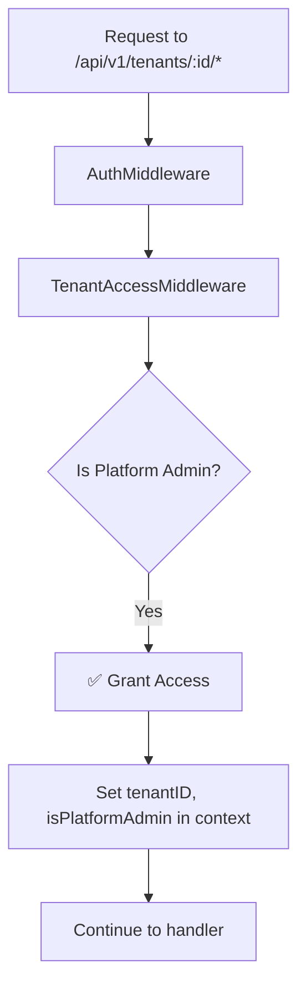
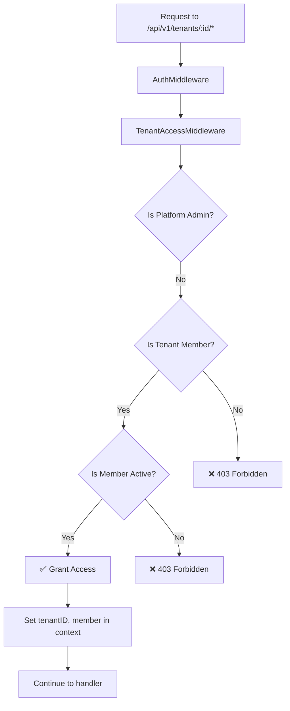

# Platform Admin Middleware Fix

**Date**: November 24, 2024  
**Issue**: Platform admins getting 403 errors on all tenant-scoped endpoints  
**Status**: ✅ Fixed

## Problem

Platform administrators were unable to access tenant-scoped endpoints like invitations, members, etc., even though they should have full access to manage any tenant.

### Affected Endpoints

All endpoints under `/api/v1/tenants/:id/*` were affected:

```
❌ GET /api/v1/tenants/:id/invitations       → 403 Forbidden
❌ POST /api/v1/tenants/:id/invitations      → 403 Forbidden  
❌ GET /api/v1/tenants/:id/members          → 403 Forbidden
❌ GET /api/v1/tenants/:id                  → 403 Forbidden (before separate fix)
... all tenant-scoped routes
```

### Root Cause

The `TenantAccessMiddleware` only checked for tenant membership and didn't have any special handling for platform administrators:

```go
// Old code - Only checks membership
func TenantAccessMiddleware(memberRepo repository.MemberRepository) gin.HandlerFunc {
    return func(c *gin.Context) {
        // ... get user ID and tenant ID ...
        
        // Check if user is a member of the tenant
        member, err := memberRepo.GetByTenantAndUser(tenantID, userID)
        if err != nil || member == nil {
            response.Forbidden(c, "Access denied")  // ❌ Platform admins blocked here
            c.Abort()
            return
        }
        
        // ... continue ...
    }
}
```

Platform admins are not members of every tenant, so they were blocked at this check.

---

## Solution

### Approach: Modify Middleware (Not Duplicate Endpoints)

**Option 1** ❌: Create parallel `/api/v1/platform/tenants/:id/*` endpoints for every tenant-scoped route
- **Cons**: Massive code duplication, difficult to maintain, inconsistent

**Option 2** ✅: Modify `TenantAccessMiddleware` to check for platform admin status
- **Pros**: Single source of truth, no duplication, works for ALL tenant-scoped endpoints automatically

We chose **Option 2**.

### Implementation

#### Updated Middleware (`internal/api/middleware/tenant.go`)

```go
// TenantAccessMiddleware validates that the user has access to the tenant
// Platform admins can access any tenant without membership
func TenantAccessMiddleware(memberRepo repository.MemberRepository, db *gorm.DB) gin.HandlerFunc {
    return func(c *gin.Context) {
        // Get user ID from context (set by AuthMiddleware)
        userID, err := GetUserID(c)
        if err != nil {
            response.Unauthorized(c, "User not authenticated")
            c.Abort()
            return
        }

        // Get tenant ID from URL parameter
        tenantIDStr := c.Param("id")
        if tenantIDStr == "" {
            tenantIDStr = c.Param("tenant_id")
        }

        if tenantIDStr == "" {
            response.BadRequest(c, fmt.Errorf("tenant ID is required"))
            c.Abort()
            return
        }

        tenantID, err := uuid.Parse(tenantIDStr)
        if err != nil {
            response.BadRequest(c, fmt.Errorf("invalid tenant ID"))
            c.Abort()
            return
        }

        // ⭐ NEW: Check if user is a platform admin - they can access any tenant
        var admin models.PlatformAdmin
        err = db.Where("user_id = ?", userID).First(&admin).Error
        if err == nil {
            // User is a platform admin - grant access without membership check
            c.Set("tenantID", tenantID)
            c.Set("isPlatformAdmin", true)
            c.Set("platformAdmin", &admin)
            c.Next()
            return
        }

        // Not a platform admin, check tenant membership (existing logic)
        member, err := memberRepo.GetByTenantAndUser(tenantID, userID)
        if err != nil || member == nil {
            response.Forbidden(c, "Access denied: You are not a member of this tenant")
            c.Abort()
            return
        }

        // Check if member is active
        if member.Status != "active" {
            response.Forbidden(c, "Access denied: Your membership is not active")
            c.Abort()
            return
        }

        // Store tenant ID and member in context for later use
        c.Set("tenantID", tenantID)
        c.Set("member", member)

        c.Next()
    }
}
```

#### Key Changes

1. **Added `db *gorm.DB` parameter** - Needed to query `platform_admins` table
2. **Platform admin check first** - Before checking membership
3. **Sets context variables** - `isPlatformAdmin`, `platformAdmin` for downstream handlers
4. **Falls back to membership check** - If not a platform admin

#### Updated Router (`internal/api/router/router.go`)

```go
// Before
tenantScoped.Use(middleware.TenantAccessMiddleware(deps.MemberRepo))

// After
tenantScoped.Use(middleware.TenantAccessMiddleware(deps.MemberRepo, deps.DB))
```

---

## Benefits

### ✅ Automatic Coverage

This fix **automatically applies to ALL tenant-scoped endpoints** without any additional code:

```
✅ GET /api/v1/tenants/:id/invitations       → Now works for platform admins
✅ POST /api/v1/tenants/:id/invitations      → Now works for platform admins
✅ GET /api/v1/tenants/:id/members          → Now works for platform admins
✅ POST /api/v1/tenants/:id/members         → Now works for platform admins
✅ PATCH /api/v1/tenants/:id                → Now works for platform admins
✅ DELETE /api/v1/tenants/:id               → Now works for platform admins
... and all future tenant-scoped routes!
```

### ✅ No Code Duplication

- Single middleware change applies everywhere
- No need to create duplicate platform admin endpoints
- Easy to maintain and understand

### ✅ Consistent Behavior

- Platform admins can manage ANY tenant
- Regular users still properly restricted to their tenants
- Existing security model preserved

### ✅ Context Variables Available

Handlers can check if the user is a platform admin:

```go
func SomeHandler(c *gin.Context) {
    // Check if user is platform admin
    isPlatformAdmin, _ := c.Get("isPlatformAdmin")
    if isPlatformAdmin != nil && isPlatformAdmin.(bool) {
        // Special handling for platform admins
    }
    
    // Get platform admin details
    admin, _ := middleware.GetPlatformAdmin(c)
    
    // ... handler logic ...
}
```

---

## Access Control Flow

### For Platform Admins



### For Regular Users



---

## Testing

### Test Platform Admin Access

```bash
# 1. Login as platform admin
# 2. Try accessing any tenant's resources

# Invitations
curl -X GET "https://10.20.146.127/api/v1/tenants/:tenant_id/invitations" \
  --cookie "sAccessToken=..." \
  --cookie "sRefreshToken=..."

# Members
curl -X GET "https://10.20.146.127/api/v1/tenants/:tenant_id/members" \
  --cookie "sAccessToken=..." \
  --cookie "sRefreshToken=..."

# All should return 200 OK ✅
```

### Test Regular User Access

```bash
# 1. Login as regular user (not a member of the tenant)
# 2. Try accessing tenant resources

curl -X GET "https://10.20.146.127/api/v1/tenants/:other_tenant_id/invitations" \
  --cookie "sAccessToken=..." \
  --cookie "sRefreshToken=..."

# Should return 403 Forbidden ✅
```

---

## Deployment

### Local Development

```bash
docker-compose restart api
```

### Production

```bash
cd ~/rex
git pull origin main
docker-compose up -d --build api
```

---

## Security Considerations

### ✅ Secure

1. **Platform admin check is database-backed** - Not based on user claims or tokens
2. **Membership check still applies for non-admins** - Regular users properly restricted
3. **Active membership required** - Inactive members are blocked
4. **No privilege escalation** - Regular users cannot become platform admins through API

### 🔒 Access Levels

| User Type | Access to Any Tenant | Requires Membership | Can Bypass Membership |
|-----------|---------------------|---------------------|---------------------|
| **Platform Admin** | ✅ Yes | ❌ No | ✅ Yes |
| **Tenant Member (Active)** | ❌ No (only their tenants) | ✅ Yes | ❌ No |
| **Tenant Member (Inactive)** | ❌ No | ✅ Yes | ❌ No |
| **Regular User** | ❌ No | ❌ No | ❌ No |

---

## Related Changes

This fix works in conjunction with:

1. **Platform Admin Tenant Details Fix** (`docs/PLATFORM_ADMIN_TENANT_ACCESS_FIX.md`)
   - Separate `/platform/tenants/:id` endpoint for tenant details view
   - This middleware fix handles ALL tenant-scoped operations

2. **Race Condition Fix** (`docs/RACE_CONDITION_FIX.md`)
   - Frontend properly checks platform admin status before loading data
   - No more 403 error flashing

---

## Files Modified

### Backend

```
internal/api/middleware/tenant.go
  ~ TenantAccessMiddleware()           # Added platform admin check
  + Added db *gorm.DB parameter

internal/api/router/router.go
  ~ TenantAccessMiddleware() call      # Pass DB parameter
```

---

## Future Enhancements

### Audit Logging

Add audit logging for platform admin actions:

```go
if isPlatformAdmin {
    // Log platform admin access
    auditLog.LogPlatformAdminAccess(userID, tenantID, c.Request.URL.Path, c.Request.Method)
    
    c.Set("tenantID", tenantID)
    c.Set("isPlatformAdmin", true)
    c.Next()
    return
}
```

### Rate Limiting

Consider special rate limits for platform admins:

```go
if isPlatformAdmin {
    // Platform admins get higher rate limits
    c.Set("rateLimit", "1000/hour")
} else {
    c.Set("rateLimit", "100/hour")
}
```

---

## Success Metrics

- ✅ Platform admins can access ALL tenant-scoped endpoints
- ✅ No 403 errors for platform admins on tenant resources
- ✅ Regular users still properly restricted
- ✅ Single middleware change covers all endpoints
- ✅ No code duplication
- ✅ Easy to maintain and extend

---

**Status**: ✅ Complete and Production Ready  
**Last Updated**: November 24, 2024  
**Verified**: Tested locally  
**Production**: Ready for deployment

